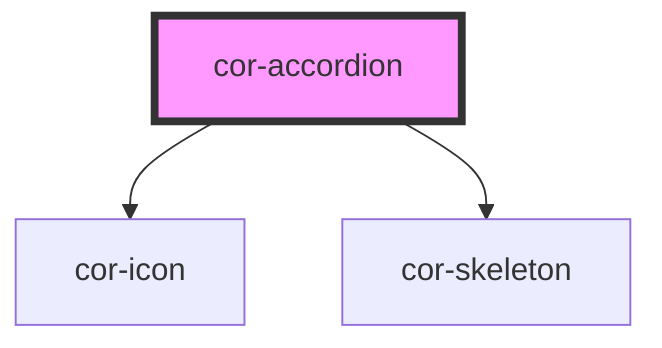

# cor-accordion

<!-- Auto Generated Below -->

## Overview

Accordion component — a slot-based disclosure widget.

## Properties

| Property       | Attribute       | Description                                                                   | Type                                                        | Default                      |
| -------------- | --------------- | ----------------------------------------------------------------------------- | ----------------------------------------------------------- | ---------------------------- |
| `disabled`     | `disabled`      | Whether the accordion is disabled — blocks all interaction                    | `boolean`                                                   | `false`                      |
| `iconPosition` | `icon-position` | Position of the chevron icon relative to summary content                      | `AccordionIconPosition.LEFT \| AccordionIconPosition.RIGHT` | `AccordionIconPosition.LEFT` |
| `open`         | `open`          | Controlled expanded state. When set externally, component becomes controlled. | `boolean`                                                   | `false`                      |
| `size`         | `size`          | Size of the accordion — controls header height, font size, icon size, padding | `AccordionSize.MD \| AccordionSize.SM`                      | `AccordionSize.MD`           |
| `skeleton`     | `skeleton`      | Whether the accordion is in skeleton loading state                            | `boolean`                                                   | `false`                      |

## Events

| Event                | Description                                | Type                                         |
| -------------------- | ------------------------------------------ | -------------------------------------------- |
| `corAccordionToggle` | Emitted after every expand/collapse toggle | `CustomEvent<CorAccordionToggleEventDetail>` |

## Slots

| Slot        | Description                                                                    |
| ----------- | ------------------------------------------------------------------------------ |
|             | Default slot for accordion panel body content                                  |
| `"summary"` | Header label content (cor-typography + optional cor-icon + optional cor-badge) |

## Dependencies

### Depends on

- [cor-icon](../cor-icon)
- [cor-skeleton](../cor-skeleton)

### Graph

----------------------------------------------

*Built with [StencilJS](https://stenciljs.com/)*
