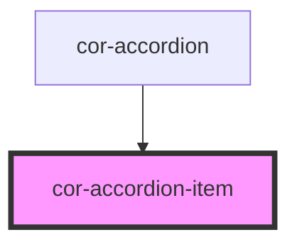

# cor-accordion-item

<!-- Auto Generated Below -->

## Overview

Accordion item — a single collapsible row inside `cor-accordion`.

Pattern B (atom-interactive): renders its own header `<button>` and a
`
` panel inside shadow DOM. The container manages
exclusivity in `mode="single"`; the item owns its visual state.

## Properties

| Property         | Attribute         | Description                                                                                                                                                                                                                                                                    | Type                         | Default     |
| ---------------- | ----------------- | ------------------------------------------------------------------------------------------------------------------------------------------------------------------------------------------------------------------------------------------------------------------------------ | ---------------------------- | ----------- |
| `appearance`     | `appearance`      | Visual treatment. - `default` — flat header, neutral background - `trail-sites` — open header gets a brand-tint background per Figma "Trail Sites"  Set by the parent `cor-accordion` via attribute; consumers should set `appearance` on the parent, not on individual items. | `"default" \| "trail-sites"` | `'default'` |
| `breakpoint`     | `breakpoint`      | Layout breakpoint. Set by the parent based on the resolved size (desktop ≥ 768px, mobile below). May also be set explicitly by consumers who need a fixed render at narrow widths.                                                                                             | `"desktop" \| "mobile"`      | `'desktop'` |
| `disabled`       | `disabled`        | Marks the item non-interactive. Header receives `aria-disabled`.                                                                                                                                                                                                               | `boolean`                    | `false`     |
| `heading`        | `heading`         | Header text. Overridden by the `heading` slot when provided.                                                                                                                                                                                                                   | `string \| undefined`        | `undefined` |
| `itemId`         | `item-id`         | Stable identifier used by the parent `cor-accordion` when emitting `corChange`. Auto-generated if omitted.                                                                                                                                                                     | `string \| undefined`        | `undefined` |
| `open`           | `open`            | Whether the item is currently expanded.                                                                                                                                                                                                                                        | `boolean`                    | `false`     |
| `supportingText` | `supporting-text` | Secondary text shown beneath the heading. Overridden by the `supporting` slot.                                                                                                                                                                                                 | `string \| undefined`        | `undefined` |

## Events

| Event       | Description                                                                                                                                                              | Type                                              |
| ----------- | ------------------------------------------------------------------------------------------------------------------------------------------------------------------------ | ------------------------------------------------- |
| `corToggle` | Emitted when the user activates the header (click / Enter / Space). The parent `cor-accordion` may cancel the implicit toggle in `mode="single"` to enforce exclusivity. | `CustomEvent<{ open: boolean; itemId: string; }>` |

## Methods

### `focusHeader() => Promise<void>`

Returns the focusable header element so the parent can implement the
Arrow/Home/End traversal contract from WAI-ARIA Accordion Pattern.

#### Returns

Type: `Promise<void>`

### `setOpen(open: boolean) => Promise<void>`

Programmatically toggle the item. Bypasses the click pipeline so the
parent `cor-accordion` does not receive a `corToggle` event — used by
the parent itself to coordinate `mode="single"` exclusivity.

#### Parameters

| Name   | Type      | Description |
| ------ | --------- | ----------- |
| `open` | `boolean` |             |

#### Returns

Type: `Promise<void>`

## Slots

| Slot           | Description                                                                                                                          |
| -------------- | ------------------------------------------------------------------------------------------------------------------------------------ |
|                | (default) Panel body. Rendered only when the item is open.                                                                           |
| `"heading"`    | Optional rich heading content. Overrides the `heading` prop.                                                                         |
| `"icon-start"` | Optional leading icon (`cor-icon` recommended).                                                                                      |
| `"supporting"` | Optional supporting text. Overrides the `supportingText` prop.                                                                       |
| `"trailing"`   | Optional trailing content (`cor-badge`, `cor-button`, label).             Sits between the heading group and the open/close trigger. |

## Shadow Parts

| Part       | Description                          |
| ---------- | ------------------------------------ |
| `"header"` | The button that toggles open/closed. |
| `"panel"`  | The region revealed when open.       |

## Dependencies

### Used by

 - [cor-accordion](.)

### Graph

----------------------------------------------

*Built with [StencilJS](https://stenciljs.com/)*
