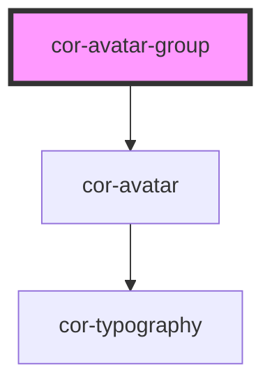

# cor-avatar-group

<!-- Auto Generated Below -->

## Overview

Avatar group component - displays multiple avatars in a compact, overlapping stack.

## Properties

| Property | Attribute | Description                                                       | Type                                                                                                          | Default         |
| -------- | --------- | ----------------------------------------------------------------- | ------------------------------------------------------------------------------------------------------------- | --------------- |
| `label`  | `label`   | Accessible label for the avatar group                             | `string \| undefined`                                                                                         | `undefined`     |
| `max`    | `max`     | Maximum number of avatars to display before showing overflow (+N) | `number \| undefined`                                                                                         | `undefined`     |
| `size`   | `size`    | Size of all avatars in the group                                  | `AvatarSize.LG \| AvatarSize.MD \| AvatarSize.MEGA_LG \| AvatarSize.SM \| AvatarSize.TWO_XS \| AvatarSize.XS` | `AvatarSize.MD` |

## Slots

| Slot | Description                          |
| ---- | ------------------------------------ |
|      | Default slot for cor-avatar elements |

## Dependencies

### Depends on

- [cor-avatar](../cor-avatar)

### Graph

----------------------------------------------

*Built with [StencilJS](https://stenciljs.com/)*
