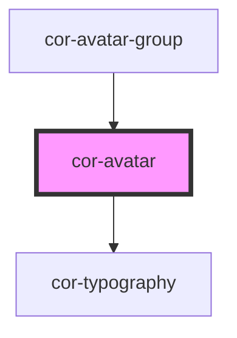

# cor-avatar

<!-- Auto Generated Below -->

## Overview

Avatar component - displays user profile pictures, initials, or icons.

## Properties

| Property   | Attribute  | Description                                                                  | Type                                                                                                          | Default         |
| ---------- | ---------- | ---------------------------------------------------------------------------- | ------------------------------------------------------------------------------------------------------------- | --------------- |
| `active`   | `active`   | Active state (applies active styling without requiring :active pseudo-class) | `boolean`                                                                                                     | `false`         |
| `disabled` | `disabled` | Indicates if avatar is disabled                                              | `boolean`                                                                                                     | `false`         |
| `hovered`  | `hovered`  | Hovered state (applies hover border styling via class)                       | `boolean`                                                                                                     | `false`         |
| `initials` | `initials` | Initials to display (1-2 characters)                                         | `string`                                                                                                      | `'AZ'`          |
| `label`    | `label`    | Accessible label for the avatar (defaults to initials value)                 | `string \| undefined`                                                                                         | `undefined`     |
| `pressed`  | `pressed`  | Pressed state (applies pressed/active border styling)                        | `boolean`                                                                                                     | `false`         |
| `size`     | `size`     | Size of the avatar                                                           | `AvatarSize.LG \| AvatarSize.MD \| AvatarSize.MEGA_LG \| AvatarSize.SM \| AvatarSize.TWO_XS \| AvatarSize.XS` | `AvatarSize.MD` |
| `skeleton` | `skeleton` | Show skeleton loading state                                                  | `boolean`                                                                                                     | `false`         |

## Slots

| Slot      | Description                       |
| --------- | --------------------------------- |
| `"icon"`  | Company logo/icon (cor-icon, svg) |
| `"image"` | Photo/logo content (img, svg)     |

## Dependencies

### Used by

 - [cor-avatar-group](../cor-avatar-group)

### Depends on

- [cor-typography](../cor-typography)

### Graph

----------------------------------------------

*Built with [StencilJS](https://stenciljs.com/)*
