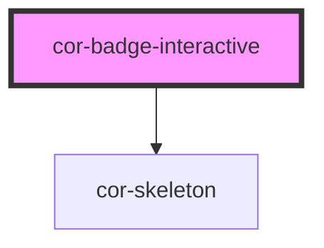

# cor-badge-interactive

<!-- Auto Generated Below -->

## Overview

Badge Interactive component - an interactive badge with optional icon, clickable and removable.

## Properties

| Property   | Attribute  | Description                                       | Type                                                                            | Default                   |
| ---------- | ---------- | ------------------------------------------------- | ------------------------------------------------------------------------------- | ------------------------- |
| `disabled` | `disabled` | Indicates if the badge is disabled                | `boolean`                                                                       | `false`                   |
| `selected` | `selected` | Indicates if the badge is selected                | `boolean`                                                                       | `false`                   |
| `size`     | `size`     | Size of the badge                                 | `BadgeInteractiveSize.MD \| BadgeInteractiveSize.SM \| BadgeInteractiveSize.XS` | `BadgeInteractiveSize.MD` |
| `skeleton` | `skeleton` | Indicates if the badge is in skeleton/empty state | `boolean`                                                                       | `false`                   |

## Events

| Event      | Description                       | Type                |
| ---------- | --------------------------------- | ------------------- |
| `corClick` | Emitted when the badge is clicked | `CustomEvent<void>` |

## Slots

| Slot     | Description                                              |
| -------- | -------------------------------------------------------- |
|          | Default slot for text content                            |
| `"icon"` | Icon slot (accepts cor-icon only, not shown for xs size) |

## Dependencies

### Depends on

- [cor-skeleton](../cor-skeleton)

### Graph

----------------------------------------------

*Built with [StencilJS](https://stenciljs.com/)*
