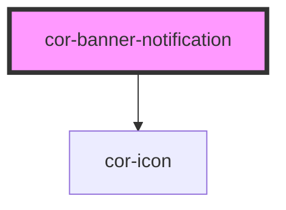

# cor-banner-notification

<!-- Auto Generated Below -->

## Overview

Full-width persistent banner notification. Typically placed at the top of a
page or section. No elevation, no auto-dismiss.

Supported states: error · warning · success · info

## Properties

| Property      | Attribute     | Description                                                                               | Type                                                                                                          | Default                  |
| ------------- | ------------- | ----------------------------------------------------------------------------------------- | ------------------------------------------------------------------------------------------------------------- | ------------------------ |
| `dismissible` | `dismissible` | When `true`, renders a dismiss button.                                                    | `boolean`                                                                                                     | `true`                   |
| `state`       | `state`       | Semantic state of the banner. Controls icon, accent colour, background, and title colour. | `NotificationState.ERROR \| NotificationState.INFO \| NotificationState.SUCCESS \| NotificationState.WARNING` | `NotificationState.INFO` |

## Events

| Event        | Description                                 | Type                |
| ------------ | ------------------------------------------- | ------------------- |
| `corDismiss` | Emitted when the user dismisses the banner. | `CustomEvent<void>` |

## Slots

| Slot           | Description                                                 |
| -------------- | ----------------------------------------------------------- |
| `"actions"`    | CTA buttons. Maximum 2 `cor-button` elements recommended.   |
| `"close-icon"` | Override the dismiss icon rendered inside the close button. |
| `"icon"`       | Override the semantic icon. Accepts `cor-icon` only.        |
| `"meta"`       | Metadata (e.g. timestamp).                                  |
| `"subtitle"`   | Supporting description.                                     |
| `"title"`      | Heading text (keep concise — single line preferred).        |

## Dependencies

### Depends on

- [cor-icon](../cor-icon)

### Graph

----------------------------------------------

*Built with [StencilJS](https://stenciljs.com/)*
