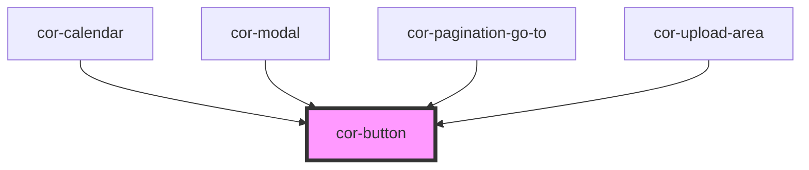

# cor-button

<!-- Auto Generated Below -->

## Overview

A button component to easily add styled markup.

## Properties

| Property   | Attribute   | Description                                           | Type                                                                                                                                                                                                                                                                                                                                                                                                                                                                                                       | Default                 |
| ---------- | ----------- | ----------------------------------------------------- | ---------------------------------------------------------------------------------------------------------------------------------------------------------------------------------------------------------------------------------------------------------------------------------------------------------------------------------------------------------------------------------------------------------------------------------------------------------------------------------------------------------- | ----------------------- |
| `iconOnly` | `icon-only` | Renders the button in icon-only mode (no text label). | `boolean`                                                                                                                                                                                                                                                                                                                                                                                                                                                                                                  | `false`                 |
| `size`     | `size`      | Indicating the size of button that will be displayed  | `"lg" \| "md" \| "sm" \| "xs" \| ButtonSize.LG \| ButtonSize.MD \| ButtonSize.SM \| ButtonSize.XS`                                                                                                                                                                                                                                                                                                                                                                                                         | `ButtonSize.MD`         |
| `variant`  | `variant`   | Indicating the color of button that will display      | `"ghost" \| "negative" \| "negative-active" \| "positive" \| "positive-active" \| "primary" \| "primary-gray" \| "primary-promo" \| "secondary" \| "secondary-gray" \| "tertiary" \| ButtonVariant.GHOST \| ButtonVariant.NEGATIVE \| ButtonVariant.NEGATIVE_ACTIVE \| ButtonVariant.POSITIVE \| ButtonVariant.POSITIVE_ACTIVE \| ButtonVariant.PRIMARY \| ButtonVariant.PRIMARY_GRAY \| ButtonVariant.PRIMARY_PROMO \| ButtonVariant.SECONDARY \| ButtonVariant.SECONDARY_GRAY \| ButtonVariant.TERTIARY` | `ButtonVariant.PRIMARY` |

## Slots

| Slot            | Description                                                                            |
| --------------- | -------------------------------------------------------------------------------------- |
| `"defaultSlot"` | the element contents to render. It can be an a or button tag.  Base button properties: |

## Dependencies

### Used by

 - [cor-calendar](../cor-calendar)
 - [cor-modal](../cor-modal)
 - [cor-pagination-go-to](../cor-pagination-go-to)
 - [cor-upload-area](../cor-upload-area)

### Graph

----------------------------------------------

*Built with [StencilJS](https://stenciljs.com/)*
