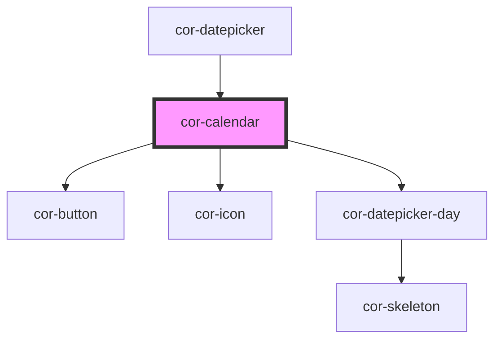

# cor-calendar

<!-- Auto Generated Below -->

## Overview

Standalone calendar panel component — single date or range selection with optional event markers.

## Properties

| Property        | Attribute        | Description                                                                                                                                                 | Type                                             | Default                 |
| --------------- | ---------------- | ----------------------------------------------------------------------------------------------------------------------------------------------------------- | ------------------------------------------------ | ----------------------- |
| `disabled`      | `disabled`       | Disables all interaction                                                                                                                                    | `boolean`                                        | `false`                 |
| `disabledDates` | --               | Array of ISO date strings (YYYY-MM-DD) that are individually disabled. These dates cannot be clicked/selected even when the calendar is not fully disabled. | `string[]`                                       | `[]`                    |
| `events`        | --               | Array of event markers to display per date                                                                                                                  | `CorCalendarEvent[]`                             | `[]`                    |
| `headerStyle`   | `header-style`   | Header layout variant. Style 1 (default): [‹] [Month Year] [›] Style 2: [Month Year ————] [‹] [›]                                                           | `"1" \| "2"`                                     | `'1'`                   |
| `mode`          | `mode`           | Selection mode: single date or date range                                                                                                                   | `CalendarMode.RANGE \| CalendarMode.SINGLE`      | `CalendarMode.SINGLE`   |
| `month`         | `month`          | Displayed month (1–12)                                                                                                                                      | `number \| undefined`                            | `undefined`             |
| `rangeEnd`      | `range-end`      | Range end date in ISO format (YYYY-MM-DD)                                                                                                                   | `string \| undefined`                            | `undefined`             |
| `rangeStart`    | `range-start`    | Range start date in ISO format (YYYY-MM-DD)                                                                                                                 | `string \| undefined`                            | `undefined`             |
| `skeleton`      | `skeleton`       | Shows skeleton loading state                                                                                                                                | `boolean`                                        | `false`                 |
| `value`         | `value`          | Selected date in ISO format (YYYY-MM-DD) — single mode                                                                                                      | `string \| undefined`                            | `undefined`             |
| `weekStartsOn`  | `week-starts-on` | First day of the week                                                                                                                                       | `CalendarWeekStart.MON \| CalendarWeekStart.SUN` | `CalendarWeekStart.SUN` |
| `year`          | `year`           | Displayed year (4-digit)                                                                                                                                    | `number \| undefined`                            | `undefined`             |

## Events

| Event            | Description                                          | Type                              |
| ---------------- | ---------------------------------------------------- | --------------------------------- |
| `corDateChange`  | Emitted when the user selects a date (single mode)   | `CustomEvent<DateChangePayload>`  |
| `corMonthChange` | Emitted when the user navigates to a different month | `CustomEvent<MonthChangePayload>` |
| `corRangeChange` | Emitted when either range boundary changes           | `CustomEvent<RangeChangePayload>` |

## Dependencies

### Used by

 - [cor-datepicker](../cor-datepicker)

### Depends on

- [cor-button](../cor-button)
- [cor-icon](../cor-icon)
- [cor-datepicker-day](../cor-datepicker-day)

### Graph

----------------------------------------------

*Built with [StencilJS](https://stenciljs.com/)*
