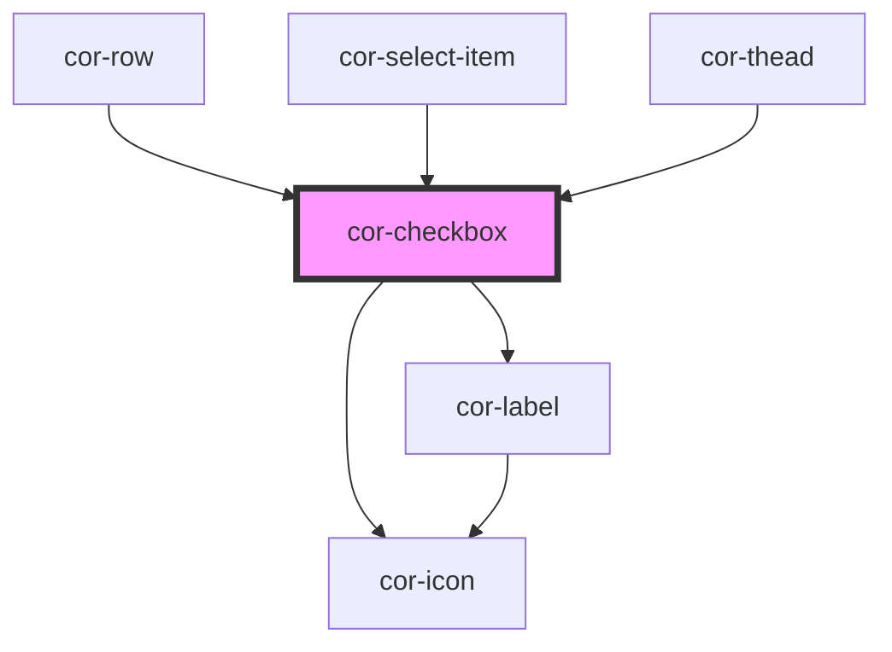

# cor-checkbox

<!-- Auto Generated Below -->

## Overview

Checkbox component with form association and indeterminate state support.

## Properties

| Property        | Attribute       | Description                                                  | Type                                                 | Default           |
| --------------- | --------------- | ------------------------------------------------------------ | ---------------------------------------------------- | ----------------- |
| `checked`       | `checked`       | Checked state                                                | `boolean`                                            | `false`           |
| `disabled`      | `disabled`      | Indicates if checkbox is disabled                            | `boolean`                                            | `false`           |
| `hovered`       | `hovered`       | Externally controlled hover state (propagated from parent)   | `boolean`                                            | `false`           |
| `indeterminate` | `indeterminate` | Indeterminate state (for "select all" checkboxes)            | `boolean`                                            | `false`           |
| `invalid`       | `invalid`       | Indicates if checkbox is invalid                             | `boolean`                                            | `false`           |
| `name`          | `name`          | Name attribute for form submission                           | `string \| undefined`                                | `undefined`       |
| `pressed`       | `pressed`       | Externally controlled pressed state (propagated from parent) | `boolean`                                            | `false`           |
| `size`          | `size`          | Size of the checkbox                                         | `"md" \| "sm" \| CheckboxSize.MD \| CheckboxSize.SM` | `CheckboxSize.MD` |
| `value`         | `value`         | Value attribute for form submission                          | `string \| undefined`                                | `'on'`            |

## Events

| Event       | Description                        | Type                   |
| ----------- | ---------------------------------- | ---------------------- |
| `corChange` | Emitted when checked state changes | `CustomEvent<boolean>` |

## Slots

| Slot | Description                    |
| ---- | ------------------------------ |
|      | Label content for the checkbox |

## Dependencies

### Used by

 - [cor-row](../cor-row)
 - [cor-select-item](../cor-select-item)
 - [cor-thead](../cor-thead)

### Depends on

- [cor-icon](../cor-icon)
- [cor-label](../cor-label)

### Graph

----------------------------------------------

*Built with [StencilJS](https://stenciljs.com/)*
