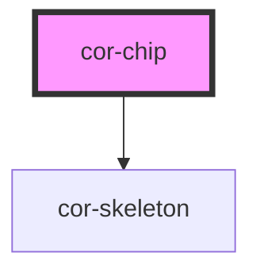

# cor-chip

<!-- Auto Generated Below -->

## Overview

Chip component — a compact, interactive element for filtering, selection, or metadata display.

## Properties

| Property    | Attribute    | Description                                   | Type                                        | Default       |
| ----------- | ------------ | --------------------------------------------- | ------------------------------------------- | ------------- |
| `active`    | `active`     | Whether the chip is in active/selected state  | `boolean`                                   | `false`       |
| `ariaLabel` | `aria-label` | Accessible label for the chip button role     | `string \| undefined`                       | `undefined`   |
| `disabled`  | `disabled`   | Whether the chip is disabled                  | `boolean`                                   | `false`       |
| `error`     | `error`      | Whether the chip is in error state            | `boolean`                                   | `false`       |
| `size`      | `size`       | Size of the chip                              | `ChipSize.LG \| ChipSize.MD \| ChipSize.SM` | `ChipSize.LG` |
| `skeleton`  | `skeleton`   | Whether the chip is in skeleton loading state | `boolean`                                   | `false`       |

## Events

| Event          | Description                                                              | Type                                   |
| -------------- | ------------------------------------------------------------------------ | -------------------------------------- |
| `corChipClick` | Emitted when the chip is clicked (not emitted when disabled or skeleton) | `CustomEvent<CorChipClickEventDetail>` |

## Slots

| Slot            | Description                                                                                    |
| --------------- | ---------------------------------------------------------------------------------------------- |
|                 | Default slot for main text content                                                             |
| `"icon-left"`   | Left icon (accepts cor-icon only). Add the `data-clickable` attribute to make it interactive.  |
| `"icon-right"`  | Right icon (accepts cor-icon only). Add the `data-clickable` attribute to make it interactive. |
| `"label"`       | Muted label text prefix                                                                        |
| `"pre-content"` | Pre-content area (accepts cor-avatar only)                                                     |

## Dependencies

### Depends on

- [cor-skeleton](../cor-skeleton)

### Graph

----------------------------------------------

*Built with [StencilJS](https://stenciljs.com/)*
