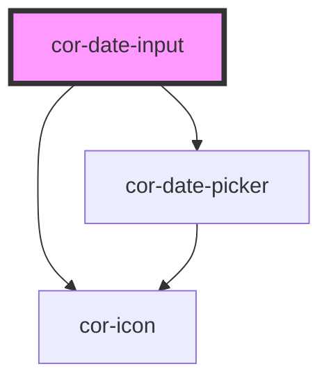

# cor-date-input

<!-- Auto Generated Below -->

## Overview

Date Input — segment-masked date entry molecule.

Pattern B (atom-interactive, form-associated): renders its own `<input>`
inside shadow DOM and overlays a ghost format hint that lets the unfilled
`DD/MM/YYYY` segments stay visible while the user types — matching the
"focus: date-populated / month-populated / fully-populated" Figma states.

## Properties

| Property      | Attribute     | Description                                                                                                                                                                                                | Type                                           | Default        |
| ------------- | ------------- | ---------------------------------------------------------------------------------------------------------------------------------------------------------------------------------------------------------- | ---------------------------------------------- | -------------- |
| `ariaLabel`   | `aria-label`  | Accessible name. Mirrors to the internal control's `aria-label` when no visible label is present.                                                                                                          | `string \| undefined`                          | `undefined`    |
| `disabled`    | `disabled`    | Disables interactivity. The internal control receives `aria-disabled` and the native `disabled` attribute.                                                                                                 | `boolean`                                      | `false`        |
| `errorText`   | `error-text`  | Plain-text error message shown below the control when `invalid` is set. When present it replaces `helperText` and pairs with the error icon.                                                               | `string \| undefined`                          | `undefined`    |
| `format`      | `format`      | Display format. The component accepts only the digits the format permits and rewrites the value with the separator inline as the user types.                                                               | `"DD/MM/YYYY" \| "MM/DD/YYYY" \| "YYYY-MM-DD"` | `'DD/MM/YYYY'` |
| `helperText`  | `helper-text` | Plain-text helper / hint shown below the control.                                                                                                                                                          | `string \| undefined`                          | `undefined`    |
| `invalid`     | `invalid`     | Forces destructive visuals regardless of `variant`. Sets `aria-invalid`. Use together with `errorText` to surface the message.                                                                             | `boolean`                                      | `false`        |
| `label`       | `label`       | Plain-text label. Use the `label` slot for richer content.                                                                                                                                                 | `string \| undefined`                          | `undefined`    |
| `max`         | `max`         | Inclusive upper bound in ISO `YYYY-MM-DD`. The validator rejects entries above this date with an `out-of-range` error.                                                                                     | `string \| undefined`                          | `undefined`    |
| `min`         | `min`         | Inclusive lower bound in ISO `YYYY-MM-DD`. The validator rejects entries below this date with an `out-of-range` error.                                                                                     | `string \| undefined`                          | `undefined`    |
| `name`        | `name`        | Form-control `name`. Used during form submission.                                                                                                                                                          | `string \| undefined`                          | `undefined`    |
| `placeholder` | `placeholder` | Placeholder shown when the control is empty. Defaults to the format pattern (`DD/MM/YYYY` / `MM/DD/YYYY` / `YYYY-MM-DD`).                                                                                  | `string \| undefined`                          | `undefined`    |
| `readonly`    | `readonly`    | Renders the field read-only. The control remains focusable and copyable.                                                                                                                                   | `boolean`                                      | `false`        |
| `required`    | `required`    | Marks the field as mandatory. Adds a red asterisk to the label and sets `aria-required` on the internal control.                                                                                           | `boolean`                                      | `false`        |
| `size`        | `size`        | Visual size rung.                                                                                                                                                                                          | `"lg" \| "md"`                                 | `'md'`         |
| `value`       | `value`       | Current display value, matching the configured `format` (e.g. `15/04/2025`). Reflects to the host attribute. Internal entry rewrites this prop as the user types — consumers can read it back at any time. | `string`                                       | `''`           |
| `variant`     | `variant`     | Color treatment. `destructive` is forced when `invalid` is set.                                                                                                                                            | `"default" \| "destructive"`                   | `'default'`    |

## Events

| Event       | Description                                                                                                                                                                                                         | Type                                 |
| ----------- | ------------------------------------------------------------------------------------------------------------------------------------------------------------------------------------------------------------------- | ------------------------------------ |
| `corBlur`   | Fires when the internal control loses focus. The native `FocusEvent` is forwarded as-is.                                                                                                                            | `CustomEvent<FocusEvent>`            |
| `corChange` | Fires when the value is committed (typically on `blur` or `Enter`). `detail.value` is the committed display value; `detail.isoValue` is the ISO `YYYY-MM-DD` when fully populated and valid, otherwise `null`.      | `CustomEvent<DateInputChangeDetail>` |
| `corFocus`  | Fires when the internal control gains focus. The native `FocusEvent` is forwarded as-is.                                                                                                                            | `CustomEvent<FocusEvent>`            |
| `corInput`  | Fires on every keystroke. `detail.value` is the current display value; `detail.isoValue` is the ISO `YYYY-MM-DD` when fully populated and valid, otherwise `null`. `detail.segment` is the segment under the caret. | `CustomEvent<DateInputTypingDetail>` |

## Slots

| Slot       | Description                                                                                             |
| ---------- | ------------------------------------------------------------------------------------------------------- |
| `"helper"` | Rich helper / hint content, replaces the `helper-text` prop. Hidden when invalid + error-text is shown. |
| `"label"`  | Rich label content, replaces the `label` prop when present.                                             |

## Shadow Parts

| Part               | Description |
| ------------------ | ----------- |
| `"control"`        |             |
| `"error"`          |             |
| `"ghost"`          |             |
| `"helper"`         |             |
| `"label"`          |             |
| `"native"`         |             |
| `"picker-popover"` |             |
| `"required-mark"`  |             |
| `"trailing-icon"`  |             |

## Dependencies

### Depends on

- [cor-icon](../cor-icon)
- [cor-date-picker](../cor-date-picker)

### Graph

----------------------------------------------

*Built with [StencilJS](https://stenciljs.com/)*
