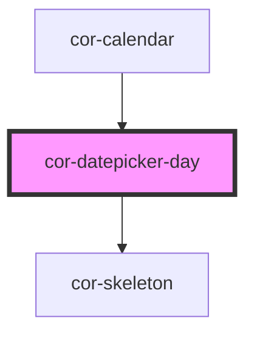

# cor-datepicker-day

<!-- Auto Generated Below -->

## Overview

Individual day cell for the datepicker calendar grid.
Used internally by cor-datepicker.

## Properties

| Property      | Attribute       | Description                                                            | Type                 | Default |
| ------------- | --------------- | ---------------------------------------------------------------------- | -------------------- | ------- |
| `dateString`  | `date-string`   | ISO date string for this day cell (YYYY-MM-DD)                         | `string`             | `''`    |
| `day`         | `day`           | The day number to display (1–31). Use 0 for empty placeholder cells.   | `number`             | `0`     |
| `dayTabIndex` | `day-tab-index` | Tab index for keyboard navigation                                      | `number`             | `-1`    |
| `disabled`    | `disabled`      | Whether this day is disabled                                           | `boolean`            | `false` |
| `empty`       | `empty`         | Whether this cell is a placeholder (out-of-month day, non-interactive) | `boolean`            | `false` |
| `events`      | --              | Event markers for this day (up to 2 rendered)                          | `CorCalendarEvent[]` | `[]`    |
| `rangeEnd`    | `range-end`     | Whether this day is the range end endpoint                             | `boolean`            | `false` |
| `rangeMiddle` | `range-middle`  | Whether this day is in the middle of a range                           | `boolean`            | `false` |
| `rangeStart`  | `range-start`   | Whether this day is the range start endpoint                           | `boolean`            | `false` |
| `selected`    | `selected`      | Whether this day is selected (single mode)                             | `boolean`            | `false` |
| `skeleton`    | `skeleton`      | Whether to show the skeleton loading state                             | `boolean`            | `false` |
| `today`       | `today`         | Whether this is today's date                                           | `boolean`            | `false` |
| `weekend`     | `weekend`       | Whether this is a weekend day (Saturday or Sunday)                     | `boolean`            | `false` |

## Events

| Event         | Description                                        | Type                                              |
| ------------- | -------------------------------------------------- | ------------------------------------------------- |
| `corDayClick` | Emitted when this day cell is clicked              | `CustomEvent<{ date: string; day: number; }>`     |
| `corDayFocus` | Emitted when this day cell receives focus          | `CustomEvent<{ date: string; day: number; }>`     |
| `corDayHover` | Emitted when this day cell is hovered or unhovered | `CustomEvent<{ date: string; active: boolean; }>` |

## Dependencies

### Used by

 - [cor-calendar](../cor-calendar)

### Depends on

- [cor-skeleton](../cor-skeleton)

### Graph

----------------------------------------------

*Built with [StencilJS](https://stenciljs.com/)*
