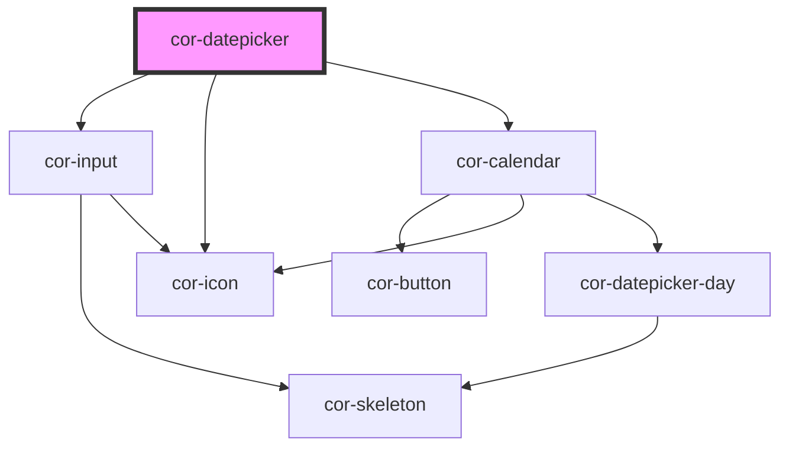

# cor-datepicker

<!-- Auto Generated Below -->

## Overview

Datepicker composite component — text input(s) with popover calendar for single date or range selection.

## Properties

| Property          | Attribute           | Description                                                                                                                                                           | Type                                                                                 | Default                 |
| ----------------- | ------------------- | --------------------------------------------------------------------------------------------------------------------------------------------------------------------- | ------------------------------------------------------------------------------------ | ----------------------- |
| `disabled`        | `disabled`          | Disables all interaction                                                                                                                                              | `boolean`                                                                            | `false`                 |
| `disabledDates`   | --                  | Array of ISO date strings (YYYY-MM-DD) that are individually disabled in the calendar. These dates cannot be selected even when the datepicker is not fully disabled. | `string[]`                                                                           | `[]`                    |
| `invalid`         | `invalid`           | Shows invalid state on the input                                                                                                                                      | `boolean`                                                                            | `false`                 |
| `label`           | `label`             | Label for the single input or the start input in range mode                                                                                                           | `string`                                                                             | `''`                    |
| `labelEnd`        | `label-end`         | Label for the end input in range mode                                                                                                                                 | `string`                                                                             | `''`                    |
| `mode`            | `mode`              | Selection mode: single date or date range                                                                                                                             | `DatepickerMode.RANGE \| DatepickerMode.RANGE_SINGLE_INPUT \| DatepickerMode.SINGLE` | `DatepickerMode.SINGLE` |
| `name`            | `name`              | Form field name attribute                                                                                                                                             | `string`                                                                             | `''`                    |
| `placeholder`     | `placeholder`       | Placeholder text shown when input has no value                                                                                                                        | `string`                                                                             | `'YYYY-MM-DD'`          |
| `rangeEnd`        | `range-end`         | Range end date in ISO format (YYYY-MM-DD) — range mode                                                                                                                | `string`                                                                             | `''`                    |
| `rangeStart`      | `range-start`       | Range start date in ISO format (YYYY-MM-DD) — range mode                                                                                                              | `string`                                                                             | `''`                    |
| `required`        | `required`          | Marks the field as required                                                                                                                                           | `boolean`                                                                            | `false`                 |
| `size`            | `size`              | Size of the input fields                                                                                                                                              | `DatepickerSize.LG \| DatepickerSize.MD \| DatepickerSize.SM`                        | `DatepickerSize.LG`     |
| `value`           | `value`             | Selected date in ISO format (YYYY-MM-DD) — single mode                                                                                                                | `string`                                                                             | `''`                    |
| `weekStartsOn`    | `week-starts-on`    | First day of the week in the calendar                                                                                                                                 | `CalendarWeekStart.MON \| CalendarWeekStart.SUN`                                     | `CalendarWeekStart.SUN` |
| `withClearButton` | `with-clear-button` | Show clear button on input(s)                                                                                                                                         | `boolean`                                                                            | `false`                 |

## Events

| Event            | Description                                    | Type                                        |
| ---------------- | ---------------------------------------------- | ------------------------------------------- |
| `corBlur`        | Emitted when the composite loses focus         | `CustomEvent<void>`                         |
| `corChange`      | Emitted when a date is selected in single mode | `CustomEvent<DatepickerChangePayload>`      |
| `corFocus`       | Emitted when the composite gains focus         | `CustomEvent<void>`                         |
| `corRangeChange` | Emitted when either range boundary changes     | `CustomEvent<DatepickerRangeChangePayload>` |

## Dependencies

### Depends on

- [cor-input](../cor-input)
- [cor-icon](../cor-icon)
- [cor-calendar](../cor-calendar)

### Graph

----------------------------------------------

*Built with [StencilJS](https://stenciljs.com/)*
