# cor-icon

<!-- Auto Generated Below -->

## Overview

Icon — renders an inline SVG fetched on-demand from per-size asset files.

Names follow the Material Symbols convention: append `-filled` to the base name
to request the filled variant (e.g. `check` outlined vs `check-filled`).

When the exact `size`/`name` combination is missing from the manifest, the
provider falls back to the closest larger size (preferred) and then to the
largest smaller size before giving up.

## Properties

| Property      | Attribute     | Description                                                                                | Type                   | Default          |
| ------------- | ------------- | ------------------------------------------------------------------------------------------ | ---------------------- | ---------------- |
| `ariaLabel`   | `aria-label`  | Accessible label. When provided, the icon is announced; when omitted it is decorative.     | `string \| undefined`  | `undefined`      |
| `color`       | `color`       | Color token suffix (mapped to `--color-{value}`), or `currentColor` to inherit text color. | `string`               | `'currentColor'` |
| `disabled`    | `disabled`    | Reflects to `[disabled]` and visually disables the icon.                                   | `boolean`              | `false`          |
| `interactive` | `interactive` | Enables interactive treatment (cursor, hover, focus ring, keyboard activation).            | `boolean`              | `false`          |
| `name`        | `name`        | Icon identifier (kebab-case). Suffix `-filled` selects the filled variant.                 | `string`               | `'check'`        |
| `size`        | `size`        | Pixel size, aligned with Figma Foundations: 12 / 16 / 20 / 24.                             | `12 \| 16 \| 20 \| 24` | `16`             |

## Dependencies

### Used by

 - [cor-avatar](../cor-avatar)
 - [cor-breadcrumb](../cor-breadcrumb)
 - [cor-cookie-banner](../cor-cookie-banner)
 - [cor-date-input](../cor-date-input)
 - [cor-file-input](../cor-file-input)
 - [cor-file-item](../cor-file-item)
 - [cor-footer](../cor-footer)
 - [cor-input](../cor-input)
 - [cor-input-chip](../cor-input-chip)
 - [cor-notification](../cor-notification)
 - [cor-numeric-input](../cor-numeric-input)
 - [cor-pagination](../cor-pagination)
 - [cor-phone-input](../cor-phone-input)
 - [cor-progress-tracker](../cor-progress-tracker)
 - [cor-search-input-circular](../cor-search-input-circular)
 - [cor-search-input-rectangular](../cor-search-input-rectangular)
 - [cor-segmented-control](../cor-segmented-control)
 - [cor-select-input](../cor-select-input)
 - [cor-tab](../cor-tabs)
 - [cor-table](../cor-table)
 - [cor-tabs](../cor-tabs)
 - [cor-textarea](../cor-textarea)

### Graph

```mermaid
graph TD;
  cor-avatar --> cor-icon
  cor-breadcrumb --> cor-icon
  cor-cookie-banner --> cor-icon
  cor-date-input --> cor-icon
  cor-file-input --> cor-icon
  cor-file-item --> cor-icon
  cor-footer --> cor-icon
  cor-input --> cor-icon
  cor-input-chip --> cor-icon
  cor-notification --> cor-icon
  cor-numeric-input --> cor-icon
  cor-pagination --> cor-icon
  cor-phone-input --> cor-icon
  cor-progress-tracker --> cor-icon
  cor-search-input-circular --> cor-icon
  cor-search-input-rectangular --> cor-icon
  cor-segmented-control --> cor-icon
  cor-select-input --> cor-icon
  cor-tab --> cor-icon
  cor-table --> cor-icon
  cor-tabs --> cor-icon
  cor-textarea --> cor-icon
  style cor-icon fill:#f9f,stroke:#333,stroke-width:4px
```

----------------------------------------------

*Built with [StencilJS](https://stenciljs.com/)*
