# cor-icon

<!-- Auto Generated Below -->

## Properties

| Property      | Attribute     | Description                                                                                                                                                                                                                                         | Type                                                                                                                              | Default                  |
| ------------- | ------------- | --------------------------------------------------------------------------------------------------------------------------------------------------------------------------------------------------------------------------------------------------- | --------------------------------------------------------------------------------------------------------------------------------- | ------------------------ |
| `ariaLabel`   | `aria-label`  | Accessible label for the icon. When provided, the icon is announced by screen readers. Omit (or leave empty) for decorative icons — they will be hidden from assistive technology.                                                                  | `string \| undefined`                                                                                                             | `undefined`              |
| `color`       | `color`       | Icon color.  You can either: - Pass a design-token suffix that maps to a CSS variable (e.g. `color="neutral-icon-weak"` -> `var(--color-icon-base-secondary)`), or - Pass `color="currentColor"` to inherit the text color from the parent element. | `string`                                                                                                                          | `'primary-icon-default'` |
| `disabled`    | `disabled`    | Disables the icon. Reflects to the host attribute so CSS `:host([disabled])` applies.                                                                                                                                                               | `boolean`                                                                                                                         | `false`                  |
| `height`      | `height`      | Indicates height of displayed icon (optional, defaults to size-based CSS variable)                                                                                                                                                                  | `number \| string \| undefined`                                                                                                   | `undefined`              |
| `interactive` | `interactive` | Enables “interactive” styling/behavior for the icon.  When `true`, the host element reflects the `interactive` attribute (so you can target it in CSS like `:host([interactive])`), typically to show hover/active states and a pointer cursor.     | `boolean`                                                                                                                         | `false`                  |
| `name`        | `name`        | Indicates name of displayed icon                                                                                                                                                                                                                    | `string`                                                                                                                          | `'carbon:add'`           |
| `size`        | `size`        | Indicates size of displayed icon                                                                                                                                                                                                                    | `(typeof IconSize)["2XS"] \| (typeof IconSize)["3XS"] \| IconSize.LG \| IconSize.MD \| IconSize.SM \| IconSize.XL \| IconSize.XS` | `IconSize.SM`            |
| `width`       | `width`       | Indicates width of displayed icon (optional, defaults to size-based CSS variable)                                                                                                                                                                   | `number \| string \| undefined`                                                                                                   | `undefined`              |

## Dependencies

### Used by

 - [cor-accordion](../cor-accordion)
 - [cor-banner-notification](../cor-banner-notification)
 - [cor-calendar](../cor-calendar)
 - [cor-checkbox](../cor-checkbox)
 - [cor-datepicker](../cor-datepicker)
 - [cor-inline-notification](../cor-inline-notification)
 - [cor-input](../cor-input)
 - [cor-label](../cor-label)
 - [cor-loading](../cor-loading)
 - [cor-modal](../cor-modal)
 - [cor-pagination-item](../cor-pagination-item)
 - [cor-radio-button](../cor-radio-button)
 - [cor-row](../cor-row)
 - [cor-select](../cor-select)
 - [cor-slot](../cor-slot)
 - [cor-sorting](../cor-sorting)
 - [cor-system-message](../cor-system-message)
 - [cor-textarea](../cor-textarea)
 - [cor-toast-notification](../cor-toast-notification)
 - [cor-upload-area](../cor-upload-area)
 - [cor-upload-file-item](../cor-upload-file-item)

### Graph

```mermaid
graph TD;
  cor-accordion --> cor-icon
  cor-banner-notification --> cor-icon
  cor-calendar --> cor-icon
  cor-checkbox --> cor-icon
  cor-datepicker --> cor-icon
  cor-inline-notification --> cor-icon
  cor-input --> cor-icon
  cor-label --> cor-icon
  cor-loading --> cor-icon
  cor-modal --> cor-icon
  cor-pagination-item --> cor-icon
  cor-radio-button --> cor-icon
  cor-row --> cor-icon
  cor-select --> cor-icon
  cor-slot --> cor-icon
  cor-sorting --> cor-icon
  cor-system-message --> cor-icon
  cor-textarea --> cor-icon
  cor-toast-notification --> cor-icon
  cor-upload-area --> cor-icon
  cor-upload-file-item --> cor-icon
  style cor-icon fill:#f9f,stroke:#333,stroke-width:4px
```

----------------------------------------------

*Built with [StencilJS](https://stenciljs.com/)*
