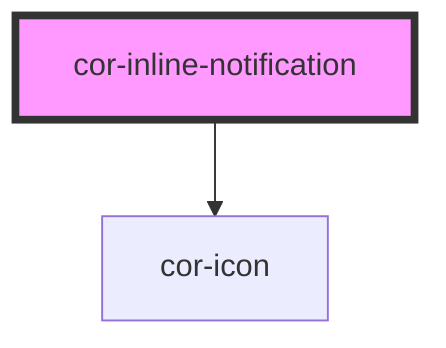

# cor-inline-notification

<!-- Auto Generated Below -->

## Overview

Contextual inline notification. Appears inside the content flow, fills the
width of its container, has no elevation, and optionally includes a dismiss button.

Supported states: error · warning · success · info

## Properties

| Property      | Attribute     | Description                                                                                     | Type                                                                                                          | Default                                |
| ------------- | ------------- | ----------------------------------------------------------------------------------------------- | ------------------------------------------------------------------------------------------------------------- | -------------------------------------- |
| `dismissible` | `dismissible` | When `true`, renders a dismiss button.                                                          | `boolean`                                                                                                     | `true`                                 |
| `state`       | `state`       | Semantic state of the notification. Controls icon, accent colour, background, and title colour. | `NotificationState.ERROR \| NotificationState.INFO \| NotificationState.SUCCESS \| NotificationState.WARNING` | `NotificationState.INFO`               |
| `variant`     | `variant`     | Visual variant of the inline notification.                                                      | `"default" \| "in-form" \| CorInlineNotificationVariant.DEFAULT \| CorInlineNotificationVariant.IN_FORM`      | `CorInlineNotificationVariant.DEFAULT` |

## Events

| Event        | Description                                       | Type                |
| ------------ | ------------------------------------------------- | ------------------- |
| `corDismiss` | Emitted when the user dismisses the notification. | `CustomEvent<void>` |

## Slots

| Slot           | Description                                                 |
| -------------- | ----------------------------------------------------------- |
| `"actions"`    | CTA buttons. Maximum 2 `cor-button` elements recommended.   |
| `"close-icon"` | Override the dismiss icon rendered inside the close button. |
| `"icon"`       | Override the semantic icon. Accepts `cor-icon` only.        |
| `"meta"`       | Metadata (e.g. timestamp).                                  |
| `"subtitle"`   | Supporting description.                                     |
| `"title"`      | Heading text (e.g. `Error`).      |

## Dependencies

### Depends on

- [cor-icon](../cor-icon)

### Graph

----------------------------------------------

*Built with [StencilJS](https://stenciljs.com/)*
