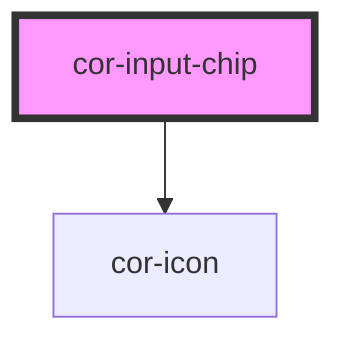

# cor-input-chip

<!-- Auto Generated Below -->

## Overview

Input Chip — multi-value text-entry control where each confirmed value
renders as a removable pill (chip / tag).

Pattern B (molecule, internal DOM, form-associated). The host owns:
  - the chip-list state (`chips` prop, two-way bound),
  - the inline `<input type="text">` for the next value,
  - regex / duplicate / max validation,
  - the keyboard contract that lets the citizen navigate between input
    and chips with arrow keys + delete chips with Backspace / Enter,
  - a `role="status"` live region that announces add / remove / reject.

The form value submitted to the surrounding `<form>` is a JSON-encoded
array of strings (e.g. `["a@b.md","c@d.md"]`) when a `name` is set.

## Properties

| Property          | Attribute          | Description                                                                                                                             | Type                         | Default     |
| ----------------- | ------------------ | --------------------------------------------------------------------------------------------------------------------------------------- | ---------------------------- | ----------- |
| `ariaLabel`       | `aria-label`       | Accessible name; mirrors to the group's `aria-label` when no visible label.                                                             | `string \| undefined`        | `undefined` |
| `chips`           | --                 | Confirmed chip values. Two-way bound: assigning a new array rerenders the list. Consumer mutations through events should set this prop. | `string[]`                   | `[]`        |
| `disabled`        | `disabled`         | Disables interactivity. Both chip remove-buttons and the text input become inert.                                                       | `boolean`                    | `false`     |
| `errorText`       | `error-text`       | Plain-text error message shown below the control when `invalid` is set.                                                                 | `string \| undefined`        | `undefined` |
| `helperText`      | `helper-text`      | Plain-text helper / hint shown below the control.                                                                                       | `string \| undefined`        | `undefined` |
| `invalid`         | `invalid`          | Forces destructive visuals regardless of `variant`.                                                                                     | `boolean`                    | `false`     |
| `label`           | `label`            | Plain-text label. Use the `label` slot for richer content.                                                                              | `string \| undefined`        | `undefined` |
| `maxChips`        | `max-chips`        | Maximum number of chips accepted. Further additions emit `corError` with `code: 'max'`.                                                 | `number \| undefined`        | `undefined` |
| `name`            | `name`             | Form-control `name`. Used during form submission (value: JSON-encoded array).                                                           | `string \| undefined`        | `undefined` |
| `placeholder`     | `placeholder`      | Placeholder shown when the inline input is empty and no chips exist.                                                                    | `string \| undefined`        | `undefined` |
| `readonly`        | `readonly`         | Renders the field read-only. The control remains focusable.                                                                             | `boolean`                    | `false`     |
| `required`        | `required`         | Marks the field as mandatory. Adds the red asterisk + `aria-required`.                                                                  | `boolean`                    | `false`     |
| `separators`      | `separators`       | Characters that confirm a chip in addition to Enter. Default is a comma.                                                                | `string`                     | `','`       |
| `size`            | `size`             | Visual size rung. Drives container min-height + chip pill scale.                                                                        | `"lg" \| "md"`               | `'md'`      |
| `validatePattern` | `validate-pattern` | Optional regex (string form). Values that don't match are rejected with `code: 'pattern'`.                                              | `string \| undefined`        | `undefined` |
| `value`           | `value`            | The not-yet-confirmed text currently typed into the inline input.                                                                       | `string`                     | `''`        |
| `variant`         | `variant`          | Color treatment. `destructive` is forced when `invalid` is set.                                                                         | `"default" \| "destructive"` | `'default'` |

## Events

| Event           | Description                                                | Type                                 |
| --------------- | ---------------------------------------------------------- | ------------------------------------ |
| `corBlur`       | Fires when the inline input loses focus.                   | `CustomEvent<FocusEvent>`            |
| `corChange`     | Fires whenever the chip array changes (add or remove).     | `CustomEvent<InputChipChangeDetail>` |
| `corChipAdd`    | Fires when a chip is successfully added.                   | `CustomEvent<InputChipAddDetail>`    |
| `corChipRemove` | Fires when a chip is removed from the list.                | `CustomEvent<InputChipRemoveDetail>` |
| `corError`      | Fires for every rejected chip (pattern / duplicate / max). | `CustomEvent<InputChipErrorDetail>`  |
| `corFocus`      | Fires when the inline input gains focus.                   | `CustomEvent<FocusEvent>`            |

## Slots

| Slot       | Description                                                  |
| ---------- | ------------------------------------------------------------ |
| `"helper"` | Rich helper / hint content, replaces the `helper-text` prop. |
| `"label"`  | Rich label content, replaces the `label` prop when present.  |

## Shadow Parts

| Part              | Description |
| ----------------- | ----------- |
| `"chip"`          |             |
| `"chip-label"`    |             |
| `"chip-remove"`   |             |
| `"control"`       |             |
| `"error"`         |             |
| `"helper"`        |             |
| `"label"`         |             |
| `"native"`        |             |
| `"required-mark"` |             |

## Dependencies

### Depends on

- [cor-icon](../cor-icon)

### Graph

----------------------------------------------

*Built with [StencilJS](https://stenciljs.com/)*
