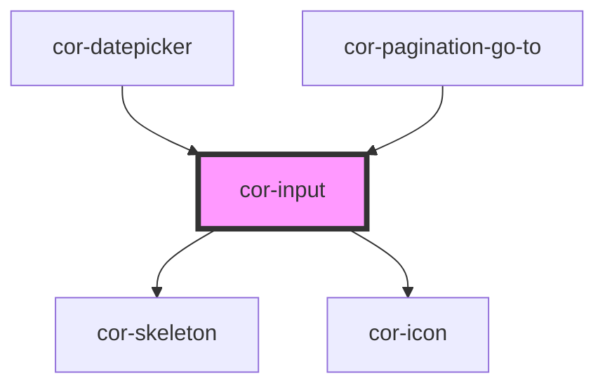

# cor-input

<!-- Auto Generated Below -->

## Overview

Input component with size variants, label positioning, and state management.

## Properties

| Property          | Attribute           | Description                                                                                                                                                         | Type                                                      | Default                     |
| ----------------- | ------------------- | ------------------------------------------------------------------------------------------------------------------------------------------------------------------- | --------------------------------------------------------- | --------------------------- |
| `autocomplete`    | `autocomplete`      | Autocomplete attribute                                                                                                                                              | `string \| undefined`                                     | `undefined`                 |
| `disabled`        | `disabled`          | Indicates if input is disabled                                                                                                                                      | `boolean`                                                 | `false`                     |
| `inline`          | `inline`            | Inline mode - width adjusts to fit visible input content                                                                                                            | `boolean`                                                 | `false`                     |
| `inputId`         | `input-id`          | Input id attribute                                                                                                                                                  | `string \| undefined`                                     | `undefined`                 |
| `invalid`         | `invalid`           | Indicates if input is invalid                                                                                                                                       | `boolean`                                                 | `false`                     |
| `label`           | `label`             | Label text                                                                                                                                                          | `string \| undefined`                                     | `undefined`                 |
| `labelInfo`       | `label-info`        | Info text to show in tooltip when hovering info icon next to label (only for labelPosition="outside") When provided, displays info icon with native browser tooltip | `string \| undefined`                                     | `undefined`                 |
| `labelPosition`   | `label-position`    | Label position (inside or outside)                                                                                                                                  | `InputLabelPosition.INSIDE \| InputLabelPosition.OUTSIDE` | `InputLabelPosition.INSIDE` |
| `max`             | `max`               | Maximum value (for number type)                                                                                                                                     | `number \| undefined`                                     | `undefined`                 |
| `maxlength`       | `maxlength`         | Maximum length (for text, email, password types)                                                                                                                    | `number \| undefined`                                     | `undefined`                 |
| `min`             | `min`               | Minimum value (for number type)                                                                                                                                     | `number \| undefined`                                     | `undefined`                 |
| `minlength`       | `minlength`         | Minimum length (for text, email, password types)                                                                                                                    | `number \| undefined`                                     | `undefined`                 |
| `name`            | `name`              | Input name attribute                                                                                                                                                | `string \| undefined`                                     | `undefined`                 |
| `pattern`         | `pattern`           | Pattern for validation (for text, email, password types)                                                                                                            | `string \| undefined`                                     | `undefined`                 |
| `placeholder`     | `placeholder`       | Input placeholder text                                                                                                                                              | `string \| undefined`                                     | `undefined`                 |
| `required`        | `required`          | Indicates if input is required                                                                                                                                      | `boolean`                                                 | `false`                     |
| `showLine`        | `show-line`         | Show separator line between content and right icon                                                                                                                  | `boolean`                                                 | `false`                     |
| `size`            | `size`              | Size of the input                                                                                                                                                   | `InputSize.LG \| InputSize.MD \| InputSize.SM`            | `InputSize.LG`              |
| `skeleton`        | `skeleton`          | Show skeleton loading state                                                                                                                                         | `boolean`                                                 | `false`                     |
| `step`            | `step`              | Step value (for number type)                                                                                                                                        | `number \| string \| undefined`                           | `undefined`                 |
| `type`            | `type`              | Input type                                                                                                                                                          | `InputType.EMAIL \| InputType.PASSWORD \| InputType.TEXT` | `InputType.TEXT`            |
| `value`           | `value`             | Input value                                                                                                                                                         | `string \| undefined`                                     | `''`                        |
| `withClearButton` | `with-clear-button` | Show clear button when input has value                                                                                                                              | `boolean`                                                 | `true`                      |

## Events

| Event      | Description                      | Type                  |
| ---------- | -------------------------------- | --------------------- |
| `corBlur`  | Emitted when input loses focus   | `CustomEvent<void>`   |
| `corFocus` | Emitted when input gains focus   | `CustomEvent<void>`   |
| `corInput` | Emitted when input value changes | `CustomEvent<string>` |

## Slots

| Slot            | Description                                                      |
| --------------- | ---------------------------------------------------------------- |
| `"helper-text"` | Helper text content slot (icon and styling handled by component) |
| `"icon-left"`   | Left icon slot                                                   |
| `"icon-right"`  | Right icon slot                                                  |

## Dependencies

### Used by

 - [cor-datepicker](../cor-datepicker)
 - [cor-pagination-go-to](../cor-pagination-go-to)

### Depends on

- [cor-skeleton](../cor-skeleton)
- [cor-icon](../cor-icon)

### Graph

----------------------------------------------

*Built with [StencilJS](https://stenciljs.com/)*
