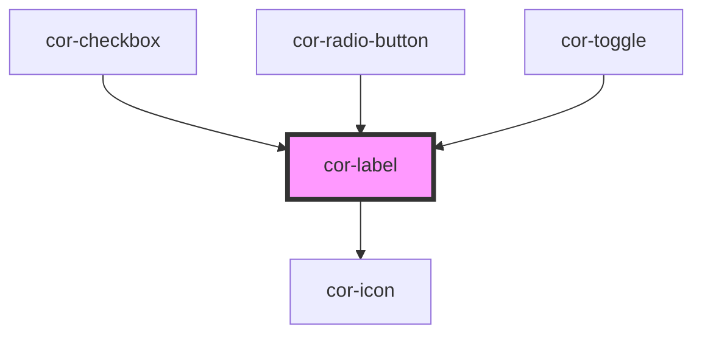

# cor-label

<!-- Auto Generated Below -->

## Overview

Label component with size variants, state management, and optional helper text.

## Properties

| Property   | Attribute   | Description                      | Type                                                                                                                                                                  | Default              |
| ---------- | ----------- | -------------------------------- | --------------------------------------------------------------------------------------------------------------------------------------------------------------------- | -------------------- |
| `as`       | `as`        | Render as different HTML element | `"label" \| "span"`                                                                                                                                                   | `'label'`            |
| `showIcon` | `show-icon` | Show icon in helper text         | `boolean`                                                                                                                                                             | `false`              |
| `size`     | `size`      | Size of the label                | `"md" \| "sm" \| LabelSize.MD \| LabelSize.SM`                                                                                                                        | `LabelSize.MD`       |
| `state`    | `state`     | State of the label               | `"active" \| "default" \| "disabled" \| "error" \| "hover" \| LabelState.ACTIVE \| LabelState.DEFAULT \| LabelState.DISABLED \| LabelState.ERROR \| LabelState.HOVER` | `LabelState.DEFAULT` |

## Slots

| Slot            | Description                                                      |
| --------------- | ---------------------------------------------------------------- |
|                 | Label text content                                               |
| `"helper-text"` | Helper text content slot (icon and styling handled by component) |

## Dependencies

### Used by

 - [cor-checkbox](../cor-checkbox)
 - [cor-radio-button](../cor-radio-button)
 - [cor-toggle](../cor-toggle)

### Depends on

- [cor-icon](../cor-icon)

### Graph

----------------------------------------------

*Built with [StencilJS](https://stenciljs.com/)*
