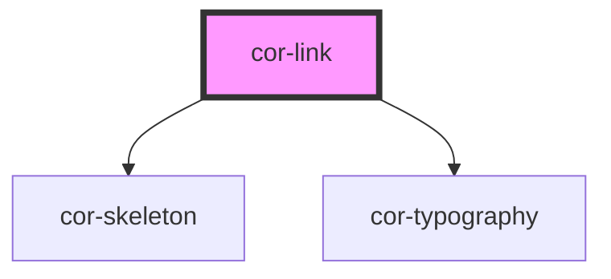

# cor-link

<!-- Auto Generated Below -->

## Overview

A link component for navigational elements with icon support.

## Properties

| Property    | Attribute    | Description                                                                                                                                                                                          | Type                                                                                                                    | Default                |
| ----------- | ------------ | ---------------------------------------------------------------------------------------------------------------------------------------------------------------------------------------------------- | ----------------------------------------------------------------------------------------------------------------------- | ---------------------- |
| `ariaLabel` | `aria-label` | Accessible label for icon-only mode. Required when using icon slot without default slot content.                                                                                                     | `string \| undefined`                                                                                                   | `undefined`            |
| `disabled`  | `disabled`   | Convenience prop to set the link to disabled state. Two-way synced with state='disabled'.                                                                                                            | `boolean`                                                                                                               | `false`                |
| `href`      | `href`       | The href for the anchor element.                                                                                                                                                                     | `string`                                                                                                                | `'#'`                  |
| `iconOnly`  | `icon-only`  | Indicates this is an icon-only link (no text label). Used for skeleton rendering and accessibility. When true, ariaLabel is required for accessibility.                                              | `boolean`                                                                                                               | `false`                |
| `size`      | `size`       | The size of the link.                                                                                                                                                                                | `LinkSize.MD \| LinkSize.SM`                                                                                            | `LinkSize.MD`          |
| `skeleton`  | `skeleton`   | Indicates if the link is in skeleton/empty state                                                                                                                                                     | `boolean`                                                                                                               | `false`                |
| `state`     | `state`      | The visual state of the link. Runtime-valid values: default, disabled, error, empty. Design-time only (Storybook/Figma): hover, focus, pressed — these are handled by CSS pseudo-classes at runtime. | `LinkState.DEFAULT \| LinkState.DISABLED \| LinkState.ERROR \| LinkState.FOCUS \| LinkState.HOVER \| LinkState.PRESSED` | `LinkState.DEFAULT`    |
| `target`    | `target`     | The target for the anchor element.                                                                                                                                                                   | `string`                                                                                                                | `'_self'`              |
| `underline` | `underline`  | Controls when the link is underlined. - 'always': Always underlined (best for accessibility in body text) - 'hover': Underlined only on hover - 'none': Never underlined                             | `LinkUnderline.ALWAYS \| LinkUnderline.HOVER \| LinkUnderline.NONE`                                                     | `LinkUnderline.ALWAYS` |

## Dependencies

### Depends on

- [cor-skeleton](../cor-skeleton)
- [cor-typography](../cor-typography)

### Graph

----------------------------------------------

*Built with [StencilJS](https://stenciljs.com/)*
