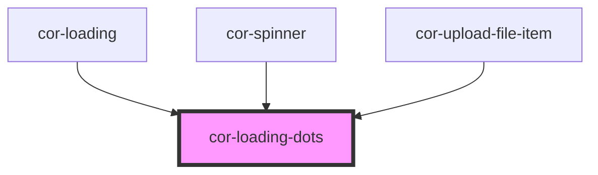

# cor-loading-dots

<!-- Auto Generated Below -->

## Overview

Loading dots component — animated three-dot indicator.
Reusable atom embedded inside cor-spinner and other loading states.
Always renders at 16×16px per Figma spec.

## Dependencies

### Used by

 - [cor-loading](../cor-loading)
 - [cor-spinner](../cor-spinner)
 - [cor-upload-file-item](../cor-upload-file-item)

### Graph

----------------------------------------------

*Built with [StencilJS](https://stenciljs.com/)*
