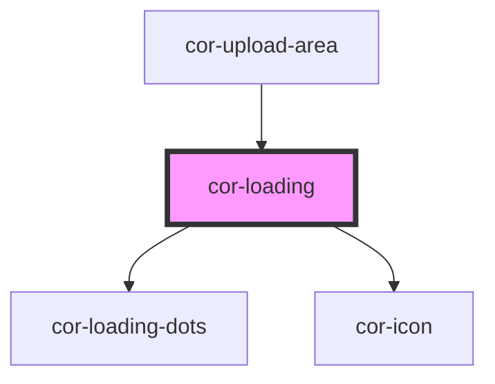

# cor-loading

<!-- Auto Generated Below -->

## Overview

Loading component — fixed 56×56px circular progress indicator with a `final` completion state.

In `loading` state: animated arc driven by `value` (0–100) with three-dot center indicator.
In `final` state: filled circle with checkmark icon signalling completion.

## Properties

| Property | Attribute | Description                                                                                                                      | Type                                         | Default                |
| -------- | --------- | -------------------------------------------------------------------------------------------------------------------------------- | -------------------------------------------- | ---------------------- |
| `label`  | `label`   | Accessible label for screen readers.                                                                                             | `string`                                     | `'Loading'`            |
| `state`  | `state`   | Current state of the loading indicator. - `loading` — animated arc + three-dot center - `final` — filled circle + checkmark icon | `LoadingState.FINAL \| LoadingState.LOADING` | `LoadingState.LOADING` |
| `value`  | `value`   | Progress value from 0 to 100. Controls the arc fill in `loading` state.                                                          | `number`                                     | `0`                    |

## Dependencies

### Used by

 - [cor-upload-area](../cor-upload-area)

### Depends on

- [cor-loading-dots](../cor-loading-dots)
- [cor-icon](../cor-icon)

### Graph

----------------------------------------------

*Built with [StencilJS](https://stenciljs.com/)*
