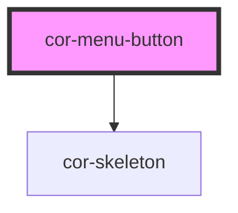

# cor-menu-button

<!-- Auto Generated Below -->

## Overview

A menu/tab button with 3 visual type variants (primary, secondary, tertiary).
Supports selected, disabled, skeleton, and icon-only states.
Propagates hover/selected/disabled state to slotted `cor-badge-interactive` children.

## Properties

| Property    | Attribute    | Description                                                                  | Type                                                                            | Default                  |
| ----------- | ------------ | ---------------------------------------------------------------------------- | ------------------------------------------------------------------------------- | ------------------------ |
| `disabled`  | `disabled`   | Whether this button is disabled (not interactive).                           | `boolean`                                                                       | `false`                  |
| `iconLabel` | `icon-label` | Accessible label for icon-only buttons. Required when iconOnly is true.      | `string \| undefined`                                                           | `undefined`              |
| `iconOnly`  | `icon-only`  | Whether this is icon-only (no text label). Primarily used with Primary type. | `boolean`                                                                       | `false`                  |
| `selected`  | `selected`   | Whether this button is currently selected/active.                            | `boolean`                                                                       | `false`                  |
| `skeleton`  | `skeleton`   | Whether to render in skeleton loading state.                                 | `boolean`                                                                       | `false`                  |
| `type`      | `type`       | Visual type variant.                                                         | `MenuButtonType.PRIMARY \| MenuButtonType.SECONDARY \| MenuButtonType.TERTIARY` | `MenuButtonType.PRIMARY` |
| `value`     | `value`      | Unique identifier used in the corMenuSelect event payload.                   | `string`                                                                        | `''`                     |

## Events

| Event           | Description                                                                                                                           | Type                              |
| --------------- | ------------------------------------------------------------------------------------------------------------------------------------- | --------------------------------- |
| `corMenuSelect` | Emitted when the button is clicked (not disabled, not skeleton). Does not update selected state internally — consumer is responsible. | `CustomEvent<{ value: string; }>` |

## Slots

| Slot           | Description                                                 |
| -------------- | ----------------------------------------------------------- |
|                | Default slot: label text and optional cor-badge-interactive |
| `"icon-left"`  | Leading icon (20×20)                                        |
| `"icon-right"` | Trailing icon (20×20)                                       |

## Dependencies

### Depends on

- [cor-skeleton](../cor-skeleton)

### Graph

----------------------------------------------

*Built with [StencilJS](https://stenciljs.com/)*
