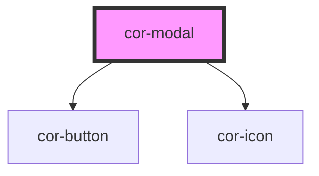

# cor-modal

<!-- Auto Generated Below -->

## Overview

A modal/drawer component with multiple placement and size variants.

## Properties

| Property          | Attribute           | Description                                                                                       | Type                                                                                                    | Default                 |
| ----------------- | ------------------- | ------------------------------------------------------------------------------------------------- | ------------------------------------------------------------------------------------------------------- | ----------------------- |
| `ariaLabel`       | `aria-label`        | Accessible label for the modal (used for aria-label when header slot is used or header is hidden) | `string \| undefined`                                                                                   | `undefined`             |
| `closeOnBackdrop` | `close-on-backdrop` | Whether clicking the backdrop closes the modal                                                    | `boolean`                                                                                               | `true`                  |
| `closeOnEscape`   | `close-on-escape`   | Whether pressing Escape closes the modal                                                          | `boolean`                                                                                               | `true`                  |
| `hideHeader`      | `hide-header`       |                                                                                                   | `boolean`                                                                                               | `false`                 |
| `open`            | `open`              | Whether the modal is open/visible                                                                 | `boolean`                                                                                               | `false`                 |
| `placement`       | `placement`         | Placement of the modal: 'right' (drawer), 'center' (dialog), or 'full' (full-width)               | `"center" \| "full" \| "right" \| ModalPlacement.CENTER \| ModalPlacement.FULL \| ModalPlacement.RIGHT` | `ModalPlacement.CENTER` |
| `size`            | `size`              | Size variant: 'sm', 'md', or 'lg'                                                                 | `"lg" \| "md" \| "sm" \| ModalSize.LG \| ModalSize.MD \| ModalSize.SM`                                  | `ModalSize.MD`          |

## Events

| Event           | Description                      | Type                |
| --------------- | -------------------------------- | ------------------- |
| `corModalClose` | Emitted when the modal is closed | `CustomEvent<void>` |
| `corModalOpen`  | Emitted when the modal is opened | `CustomEvent<void>` |

## Methods

### `close() => Promise<void>`

Closes the modal programmatically

#### Returns

Type: `Promise<void>`

### `show() => Promise<void>`

Opens the modal programmatically

#### Returns

Type: `Promise<void>`

## Slots

| Slot               | Description                                                              |
| ------------------ | ------------------------------------------------------------------------ |
|                    | Default slot for modal body content                                      |
| `"footer"`         | Footer content for actions                                               |
| `"header"`         | Full header override (replaces title, actions and close button entirely) |
| `"header-actions"` | Extra action buttons in the header, rendered before the close button     |
| `"title"`          | Title content projected into the modal header                            |

## Dependencies

### Depends on

- [cor-button](../cor-button)
- [cor-icon](../cor-icon)

### Graph

----------------------------------------------

*Built with [StencilJS](https://stenciljs.com/)*
