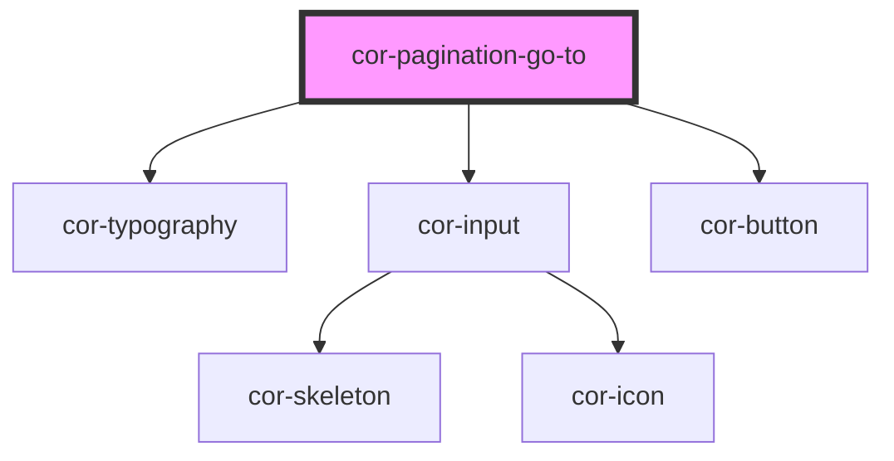

# cor-pagination-go-to

<!-- Auto Generated Below -->

## Overview

Pagination "Go to page" control — label, number input, and Go button.

## Properties

| Property   | Attribute  | Description                            | Type                                                                      | Default                 |
| ---------- | ---------- | -------------------------------------- | ------------------------------------------------------------------------- | ----------------------- |
| `disabled` | `disabled` | Disables the input and button          | `boolean`                                                                 | `false`                 |
| `maxPage`  | `max-page` | Maximum allowed page number            | `number`                                                                  | `Infinity`              |
| `minPage`  | `min-page` | Minimum allowed page number            | `number`                                                                  | `1`                     |
| `page`     | `page`     | Current page number shown in the input | `number`                                                                  | `1`                     |
| `size`     | `size`     | Size of the component                  | `PaginationGoToSize.LG \| PaginationGoToSize.MD \| PaginationGoToSize.SM` | `PaginationGoToSize.LG` |

## Events

| Event         | Description                                                       | Type                             |
| ------------- | ----------------------------------------------------------------- | -------------------------------- |
| `corGoToPage` | Emitted when the user clicks Go — carries the page number entered | `CustomEvent<{ page: number; }>` |

## Dependencies

### Depends on

- [cor-typography](../cor-typography)
- [cor-input](../cor-input)
- [cor-button](../cor-button)

### Graph

----------------------------------------------

*Built with [StencilJS](https://stenciljs.com/)*
