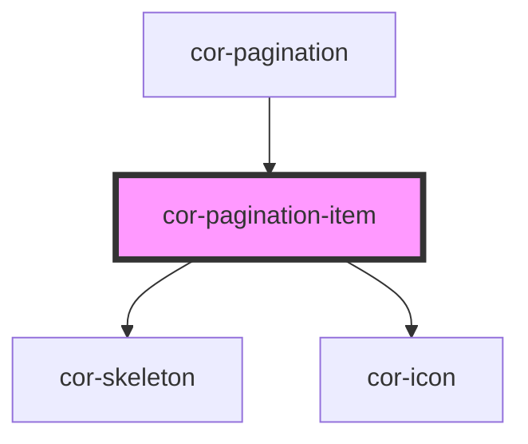

# cor-pagination-item

<!-- Auto Generated Below -->

## Overview

Individual pagination button — renders a page number, navigation icon, or collapsed "..." with options list.

## Properties

| Property         | Attribute       | Description                                                       | Type                                                                                                     | Default                           |
| ---------------- | --------------- | ----------------------------------------------------------------- | -------------------------------------------------------------------------------------------------------- | --------------------------------- |
| `collapsedPages` | --              | Pages to show in the collapsed dropdown (for itemType=collapsed)  | `number[]`                                                                                               | `[]`                              |
| `disabled`       | `disabled`      | Disables the item                                                 | `boolean`                                                                                                | `false`                           |
| `icon`           | `icon`          | Carbon icon name (for icon type)                                  | `string`                                                                                                 | `''`                              |
| `iconLabel`      | `icon-label`    | Accessible label for icon buttons                                 | `string`                                                                                                 | `''`                              |
| `itemType`       | `item-type`     | Type of the item                                                  | `PaginationItemType.COLLAPSED \| PaginationItemType.ICON \| PaginationItemType.NUMBER`                   | `PaginationItemType.NUMBER`       |
| `listPosition`   | `list-position` | Position of the dropdown list relative to the button              | `PaginationItemListPosition.AUTO \| PaginationItemListPosition.BOTTOM \| PaginationItemListPosition.TOP` | `PaginationItemListPosition.AUTO` |
| `page`           | `page`          | Page number this item represents (for number and collapsed types) | `number`                                                                                                 | `0`                               |
| `selected`       | `selected`      | Whether this item represents the currently selected page          | `boolean`                                                                                                | `false`                           |
| `size`           | `size`          | Size of the item                                                  | `PaginationItemSize.LG \| PaginationItemSize.MD \| PaginationItemSize.SM`                                | `PaginationItemSize.LG`           |
| `skeleton`       | `skeleton`      | Shows the skeleton loading state                                  | `boolean`                                                                                                | `false`                           |

## Events

| Event          | Description                           | Type                             |
| -------------- | ------------------------------------- | -------------------------------- |
| `corItemClick` | Emitted when a page number is clicked | `CustomEvent<{ page: number; }>` |

## Dependencies

### Used by

 - [cor-pagination](../cor-pagination)

### Depends on

- [cor-skeleton](../cor-skeleton)
- [cor-icon](../cor-icon)

### Graph

----------------------------------------------

*Built with [StencilJS](https://stenciljs.com/)*
