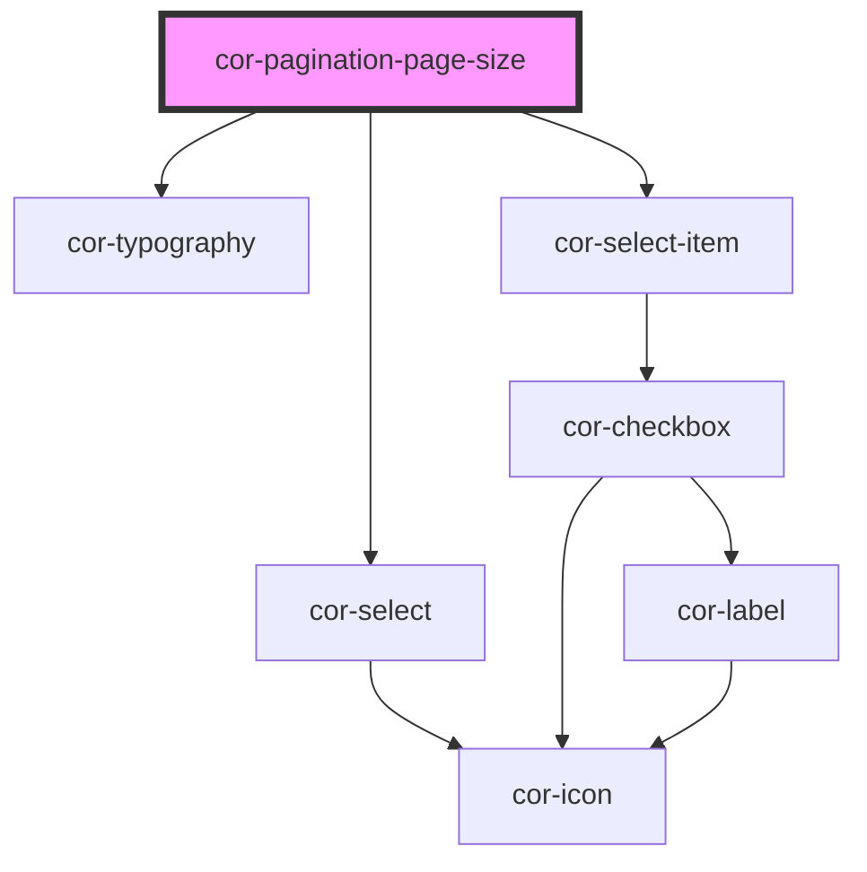

# cor-pagination-page-size

<!-- Auto Generated Below -->

## Overview

Pagination "Show" control — label, page size selector, and optional total items display.

## Properties

| Property     | Attribute     | Description                                                                              | Type                                                                                  | Default                     |
| ------------ | ------------- | ---------------------------------------------------------------------------------------- | ------------------------------------------------------------------------------------- | --------------------------- |
| `disabled`   | `disabled`    | Disables the selector                                                                    | `boolean`                                                                             | `false`                     |
| `pageSize`   | `page-size`   | Currently selected page size                                                             | `number`                                                                              | `12`                        |
| `pageSizes`  | `page-sizes`  | Available page size options — accepts a number array or comma-separated string attribute | `number[] \| string`                                                                  | `[12]`                      |
| `size`       | `size`        | Size of the component                                                                    | `PaginationPageSizeSize.LG \| PaginationPageSizeSize.MD \| PaginationPageSizeSize.SM` | `PaginationPageSizeSize.LG` |
| `totalItems` | `total-items` | Total number of items — when provided, shows "/ {totalItems}" suffix                     | `number \| undefined`                                                                 | `undefined`                 |

## Events

| Event               | Description                                   | Type                                 |
| ------------------- | --------------------------------------------- | ------------------------------------ |
| `corPageSizeChange` | Emitted when the user selects a new page size | `CustomEvent<{ pageSize: number; }>` |

## Dependencies

### Depends on

- [cor-typography](../cor-typography)
- [cor-select](../cor-select)
- [cor-select-item](../cor-select-item)

### Graph

----------------------------------------------

*Built with [StencilJS](https://stenciljs.com/)*
