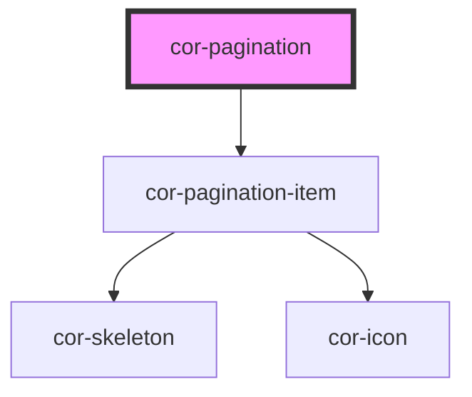

# cor-pagination

<!-- Auto Generated Below -->

## Overview

Pagination navigation control with two style variants, three sizes, and smart page range computation.

Style 1: prev/next chevrons, page numbers with "..." collapsed ranges.
Style 2: first/prev/next/last icon buttons, page numbers only.

## Properties

| Property          | Attribute          | Description                                                                                        | Type                                                          | Default                   |
| ----------------- | ------------------ | -------------------------------------------------------------------------------------------------- | ------------------------------------------------------------- | ------------------------- |
| `currentPage`     | `current-page`     | Currently selected page (1-indexed)                                                                | `number`                                                      | `1`                       |
| `disabled`        | `disabled`         | Disables all interactions                                                                          | `boolean`                                                     | `false`                   |
| `paginationStyle` | `pagination-style` | Visual style variant                                                                               | `PaginationStyle.STYLE_1 \| PaginationStyle.STYLE_2`          | `PaginationStyle.STYLE_1` |
| `shown`           | `shown`            | Maximum number of page number buttons to show at once (not counting first/last always-shown pages) | `number`                                                      | `4`                       |
| `size`            | `size`             | Size of the pagination component                                                                   | `PaginationSize.LG \| PaginationSize.MD \| PaginationSize.SM` | `PaginationSize.LG`       |
| `skeleton`        | `skeleton`         | Shows skeleton loading state                                                                       | `boolean`                                                     | `false`                   |
| `totalPages`      | `total-pages`      | Total number of pages                                                                              | `number`                                                      | `1`                       |

## Events

| Event           | Description                          | Type                             |
| --------------- | ------------------------------------ | -------------------------------- |
| `corPageChange` | Emitted when the user selects a page | `CustomEvent<{ page: number; }>` |

## Dependencies

### Depends on

- [cor-pagination-item](../cor-pagination-item)

### Graph

----------------------------------------------

*Built with [StencilJS](https://stenciljs.com/)*
