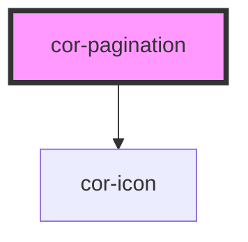

# cor-pagination

<!-- Auto Generated Below -->

## Overview

Pagination — navigation control for paged content.

Renders a list of page-number buttons flanked by Previous / Next controls.
The visible page list is computed from `currentPage`, `totalPages`,
`siblingCount`, and `boundaryCount`. When the total exceeds the visible
window, ellipses (`...`) appear at the start and/or end of the range.

The component is internally controlled but exposes a `corChange` event so
the host can drive the active page. Updating `current-page` from outside
is also honoured (e.g. when the URL changes via routing).

## Properties

| Property        | Attribute         | Description                                                                                                                                       | Type           | Default                                       |
| --------------- | ----------------- | ------------------------------------------------------------------------------------------------------------------------------------------------- | -------------- | --------------------------------------------- |
| `ariaLabel`     | `aria-label`      | Accessible name for the outer `<nav>` landmark.                                                                                                   | `string`       | `'Navigare pagini'`                           |
| `boundaryCount` | `boundary-count`  | Number of page buttons shown at the start and end of the range (before / after the leading / trailing ellipsis).                                  | `number`       | `1`                                           |
| `currentPage`   | `current-page`    | The active page (1-indexed). Mutable so consumers can two-way bind.                                                                               | `number`       | `1`                                           |
| `nextAriaLabel` | `next-aria-label` | Accessible label template for the Next button. The `{page}` token is replaced with the target page number.                                        | `string`       | `'Pagina următoare, mergi la pagina {page}'`  |
| `nextLabel`     | `next-label`      | Visible label for the Next button (desktop only — hidden on `sm`).                                                                                | `string`       | `'Următor'`                                   |
| `pageAriaLabel` | `page-aria-label` | Accessible label template for an individual page button. Tokens `{page}` and `{total}` are substituted with the page number and total page count. | `string`       | `'Pagina {page} din {total}'`                 |
| `prevAriaLabel` | `prev-aria-label` | Accessible label template for the Previous button. The `{page}` token is replaced with the target page number.                                    | `string`       | `'Pagina anterioară, mergi la pagina {page}'` |
| `prevLabel`     | `prev-label`      | Visible label for the Previous button (desktop only — hidden on `sm`).                                                                            | `string`       | `'Anterior'`                                  |
| `showPrevNext`  | `show-prev-next`  | Whether to render the Previous / Next navigation buttons.                                                                                         | `boolean`      | `true`                                        |
| `siblingCount`  | `sibling-count`   | Number of page buttons shown on each side of the active page.                                                                                     | `number`       | `1`                                           |
| `size`          | `size`            | Visual size rung. Mobile breakpoints typically use `sm` (32px) and desktop uses `md` (40px).                                                      | `"md" \| "sm"` | `'md'`                                        |
| `totalPages`    | `total-pages`     | Total number of pages. When `<= 1` the component renders nothing.                                                                                 | `number`       | `1`                                           |

## Events

| Event       | Description | Type                                  |
| ----------- | ----------- | ------------------------------------- |
| `corChange` |             | `CustomEvent<PaginationChangeDetail>` |

## Slots

| Slot          | Description                                                                                                        |
| ------------- | ------------------------------------------------------------------------------------------------------------------ |
| `"next-icon"` | Optional icon override for the Next button.             Defaults to a right chevron.                               |
| `"prev-icon"` | Optional icon override for the Previous button.             Defaults to a left chevron sized for the current rung. |

## Dependencies

### Depends on

- [cor-icon](../cor-icon)

### Graph

----------------------------------------------

*Built with [StencilJS](https://stenciljs.com/)*
