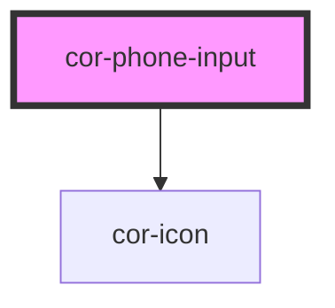

# cor-phone-input

<!-- Auto Generated Below -->

## Overview

Phone Input — phone-number entry molecule with country-code prefix and
format mask. The most Moldova-specific input in the family: it ships a
default `+373` country, a curated diaspora-relevant country list, and
Romanian-voice placeholder + error copy.

Pattern B (molecule, form-associated): renders its own `<input type="tel">`
inside shadow DOM alongside a combobox trigger that opens a country
listbox. The trigger and the input share one continuous border /
focus-ring contract — they look like a single field, divided by a
vertical rule. Form participation works via `formAssociated` +
`ElementInternals`; the form value is the canonical E.164 string
(`+37362123456`).

## Properties

| Property         | Attribute         | Description                                                                                                                                                                                                                                                         | Type                         | Default     |
| ---------------- | ----------------- | ------------------------------------------------------------------------------------------------------------------------------------------------------------------------------------------------------------------------------------------------------------------- | ---------------------------- | ----------- |
| `ariaLabel`      | `aria-label`      | Accessible name. Mirrors to the internal control's `aria-label` when no visible label is present.                                                                                                                                                                   | `string \| undefined`        | `undefined` |
| `countries`      | --                | Optional whitelist of ISO codes to surface in the dropdown. Defaults to the curated 15-country Moldova-diaspora list when omitted.                                                                                                                                  | `string[] \| undefined`      | `undefined` |
| `defaultCountry` | `default-country` | Initial country selection (ISO 3166-1 alpha-2). Defaults to Moldova because the system serves citizens calling government services.                                                                                                                                 | `string`                     | `'MD'`      |
| `disabled`       | `disabled`        | Disables interactivity. Trigger and input receive `aria-disabled` and the native `disabled` attribute.                                                                                                                                                              | `boolean`                    | `false`     |
| `errorText`      | `error-text`      | Plain-text error message shown below the control when `invalid` is set. When present it replaces `helperText` and pairs with the error icon. Defaults to the Romanian message `"Numărul de telefon este incomplet"` when `invalid` is set without a custom message. | `string \| undefined`        | `undefined` |
| `helperText`     | `helper-text`     | Plain-text helper / hint shown below the control.                                                                                                                                                                                                                   | `string \| undefined`        | `undefined` |
| `invalid`        | `invalid`         | Forces destructive visuals regardless of `variant`. Sets `aria-invalid`. Use together with `errorText` to surface the message.                                                                                                                                      | `boolean`                    | `false`     |
| `label`          | `label`           | Plain-text label. Use the `label` slot for richer content.                                                                                                                                                                                                          | `string \| undefined`        | `undefined` |
| `name`           | `name`            | Form-control `name`. Used during form submission with the E.164 value.                                                                                                                                                                                              | `string \| undefined`        | `undefined` |
| `open`           | `open`            | Reflects the open state of the country listbox. Mutate via `corOpen` / `corClose` events, not by writing to the attribute.                                                                                                                                          | `boolean`                    | `false`     |
| `placeholder`    | `placeholder`     | Placeholder shown when the local segment is empty. Defaults to the country's mask.                                                                                                                                                                                  | `string \| undefined`        | `undefined` |
| `readonly`       | `readonly`        | Renders the field read-only. The input remains focusable and copyable; the country dropdown cannot be opened.                                                                                                                                                       | `boolean`                    | `false`     |
| `required`       | `required`        | Marks the field as mandatory. Adds a red asterisk to the label and sets `aria-required` on the internal control.                                                                                                                                                    | `boolean`                    | `false`     |
| `size`           | `size`            | Visual size rung.                                                                                                                                                                                                                                                   | `"lg" \| "md"`               | `'md'`      |
| `value`          | `value`           | Current value — canonical E.164 (`+37362123456`). Reflects to the host attribute. Empty string represents an unfilled field.                                                                                                                                        | `string`                     | `''`        |
| `variant`        | `variant`         | Color treatment. `destructive` is forced when `invalid` is set.                                                                                                                                                                                                     | `"default" \| "destructive"` | `'default'` |

## Events

| Event              | Description                                                                                                                                                         | Type                                         |
| ------------------ | ------------------------------------------------------------------------------------------------------------------------------------------------------------------- | -------------------------------------------- |
| `corBlur`          | Fires when the internal input loses focus. The native `FocusEvent` is forwarded as-is.                                                                              | `CustomEvent<FocusEvent>`                    |
| `corChange`        | Fires when the value is committed (typically on `blur` or `Enter`). `detail.isValid` reflects whether the local-segment length sits in the active country's window. | `CustomEvent<PhoneInputChangeDetail>`        |
| `corClose`         | Fires when the country listbox closes.                                                                                                                              | `CustomEvent<void>`                          |
| `corCountryChange` | Fires when the user picks a different country from the dropdown.                                                                                                    | `CustomEvent<PhoneInputCountryChangeDetail>` |
| `corFocus`         | Fires when the internal input gains focus. The native `FocusEvent` is forwarded as-is.                                                                              | `CustomEvent<FocusEvent>`                    |
| `corInput`         | Fires on every keystroke. `detail.value` is the current canonical E.164 string; `detail.countryCode` is the active ISO 3166-1 alpha-2.                              | `CustomEvent<PhoneInputInputDetail>`         |
| `corOpen`          | Fires when the country listbox opens.                                                                                                                               | `CustomEvent<void>`                          |

## Slots

| Slot       | Description                                                                                             |
| ---------- | ------------------------------------------------------------------------------------------------------- |
| `"helper"` | Rich helper / hint content, replaces the `helper-text` prop. Hidden when invalid + error-text is shown. |
| `"label"`  | Rich label content, replaces the `label` prop when present.                                             |

## Shadow Parts

| Part                     | Description |
| ------------------------ | ----------- |
| `"control"`              |             |
| `"country-trigger"`      |             |
| `"country-trigger-code"` |             |
| `"divider"`              |             |
| `"error"`                |             |
| `"helper"`               |             |
| `"label"`                |             |
| `"listbox"`              |             |
| `"native"`               |             |
| `"required-mark"`        |             |

## Dependencies

### Depends on

- [cor-icon](../cor-icon)

### Graph

----------------------------------------------

*Built with [StencilJS](https://stenciljs.com/)*
