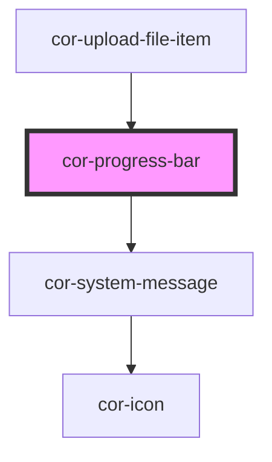

# cor-progress-bar

<!-- Auto Generated Below -->

## Overview

A progress bar component that visually communicates the completion status
of a task or process. Supports default (info) and error types, three sizes,
an optional percentage display, and optional label and message slots.

## Properties

| Property            | Attribute            | Description                                                                                                                                          | Type                                                             | Default                   |
| ------------------- | -------------------- | ---------------------------------------------------------------------------------------------------------------------------------------------------- | ---------------------------------------------------------------- | ------------------------- |
| `animatePercentage` | `animate-percentage` | When `true`, the percentage counter animates smoothly between values (easeOutCubic, 400ms). Requires `showPercentage` to be `true`.                  | `boolean`                                                        | `false`                   |
| `ariaLabel`         | `aria-label`         | Accessible label for the progress track read by screen readers. When not set, falls back to the text content of the label slot, then to "Progress".  | `string \| undefined`                                            | `undefined`               |
| `showPercentage`    | `show-percentage`    | When `true`, the numeric percentage is shown alongside the label. Has no effect when `label` is not set.                                             | `boolean`                                                        | `false`                   |
| `size`              | `size`               | Height of the progress track.                                                                                                                        | `ProgressBarSize.LG \| ProgressBarSize.MD \| ProgressBarSize.SM` | `ProgressBarSize.LG`      |
| `type`              | `type`               | Visual type / colour variant. - `default` — Primary fill colour with info system message. - `error`   — Error fill colour with alert system message. | `ProgressBarType.DEFAULT \| ProgressBarType.ERROR`               | `ProgressBarType.DEFAULT` |
| `value`             | `value`              | Current progress value, 0–100. Values outside this range are clamped.                                                                                | `number`                                                         | `0`                       |

## Slots

| Slot        | Description                                                                               |
| ----------- | ----------------------------------------------------------------------------------------- |
| `"label"`   | Optional label rendered above the track                                                   |
| `"message"` | Optional helper/system message below the track (wrapped in cor-system-message internally) |

## Shadow Parts

| Part      | Description                                     |
| --------- | ----------------------------------------------- |
| `"track"` | The progress track element (role="progressbar") |

## Dependencies

### Used by

 - [cor-upload-file-item](../cor-upload-file-item)

### Depends on

- [cor-system-message](../cor-system-message)

### Graph

----------------------------------------------

*Built with [StencilJS](https://stenciljs.com/)*
