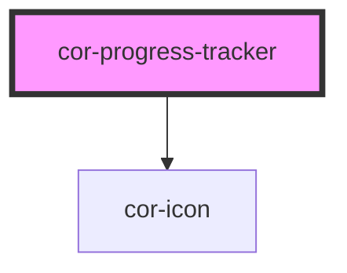

# cor-progress-tracker

<!-- Auto Generated Below -->

## Overview

Progress Tracker (Stepper) — visualises a user's position in a multi-step process.

Two flavours:

- **Display tracker** (`interactive=false`, default) — read-only. Each step is a
  `<li>` carrying ARIA semantics. Use for sign-up wizards, KYC flows, document
  submissions where the parent app drives navigation.
- **Interactive tracker** (`interactive=true`) — each completed (and the current)
  step renders as a `<button>` and emits `corStepClick`. Pending steps remain
  non-actionable per the WAI-ARIA stepper pattern.

State legend (Figma node 267:6905):
  - `pending`    — neutral grey ring + faded number
  - `current`    — brand ring + brand number, label in default text colour
  - `completed`  — brand filled circle + white checkmark
  - `error`      — danger ring + danger cross

The component renders an ordered list with `role="list"` for AT compatibility
(Safari + VoiceOver strip implicit list roles when `list-style: none` is set).

## Properties

| Property      | Attribute      | Description                                                                                                                                                                                                    | Type                                 | Default        |
| ------------- | -------------- | -------------------------------------------------------------------------------------------------------------------------------------------------------------------------------------------------------------- | ------------------------------------ | -------------- |
| `ariaLabel`   | `aria-label`   | Accessible name for the surrounding list landmark. Falls back to `'Progress tracker'` (English) — Romanian consumers can pass `'Pași'`.                                                                        | `string \| undefined`                | `undefined`    |
| `currentStep` | `current-step` | Optional zero-based index of the current step. When set, it overrides the `status: 'current'` value in `steps`. Mostly useful for parent-driven flows that mutate a single number rather than the whole array. | `number \| undefined`                | `undefined`    |
| `interactive` | `interactive`  | When true, completed and current steps render as `<button>` elements and emit `corStepClick`. Pending and error steps remain non-actionable in this mode.                                                      | `boolean`                            | `false`        |
| `orientation` | `orientation`  | Layout orientation.   - `horizontal` (default): steps flow left to right; labels render under indicators.   - `vertical`: steps stack top to bottom; labels render to the right of indicators.                 | `"horizontal" \| "vertical"`         | `'horizontal'` |
| `steps`       | --             | Declarative step list. Each item: `{ id?, label, supportingText?, status, iconName?, disabled? }`. `status` drives the visual state and ARIA semantics — see {@link ProgressTrackerStepStatus}.                | `ProgressTrackerStep[] \| undefined` | `undefined`    |

## Events

| Event          | Description                                                                                                                                                                                                        | Type                                                         |
| -------------- | ------------------------------------------------------------------------------------------------------------------------------------------------------------------------------------------------------------------ | ------------------------------------------------------------ |
| `corStepClick` | Emitted when an interactive step is activated via mouse, keyboard, or AT. Detail carries the `index` and the full `step` object that was clicked. Only fires when `interactive=true` and the step is not disabled. | `CustomEvent<{ index: number; step: ProgressTrackerStep; }>` |

## Slots

| Slot | Description                                                                                                     |
| ---- | --------------------------------------------------------------------------------------------------------------- |
|      | (default) Reserved for future slot-mode authoring. Currently unused —   consumers should pass the `steps` prop. |

## Dependencies

### Depends on

- [cor-icon](../cor-icon)

### Graph

----------------------------------------------

*Built with [StencilJS](https://stenciljs.com/)*
