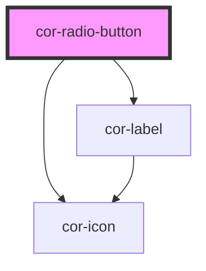

# cor-radio-button

<!-- Auto Generated Below -->

## Overview

Radio button component with form association.

## Properties

| Property             | Attribute  | Description                                                | Type                                       | Default              |
| -------------------- | ---------- | ---------------------------------------------------------- | ------------------------------------------ | -------------------- |
| `checked`            | `checked`  | Checked state                                              | `boolean`                                  | `false`              |
| `disabled`           | `disabled` | Indicates if radio button is disabled                      | `boolean`                                  | `false`              |
| `invalid`            | `invalid`  | Indicates if radio button is invalid                       | `boolean`                                  | `false`              |
| `name` _(required)_  | `name`     | Name attribute for form submission (required for grouping) | `string`                                   | `undefined`          |
| `size`               | `size`     | Size of the radio button                                   | `RadioButtonSize.MD \| RadioButtonSize.SM` | `RadioButtonSize.MD` |
| `value` _(required)_ | `value`    | Value attribute for form submission                        | `string`                                   | `undefined`          |

## Events

| Event       | Description                        | Type                   |
| ----------- | ---------------------------------- | ---------------------- |
| `corChange` | Emitted when checked state changes | `CustomEvent<boolean>` |

## Slots

| Slot | Description                        |
| ---- | ---------------------------------- |
|      | Label content for the radio button |

## Dependencies

### Depends on

- [cor-icon](../cor-icon)
- [cor-label](../cor-label)

### Graph

----------------------------------------------

*Built with [StencilJS](https://stenciljs.com/)*
