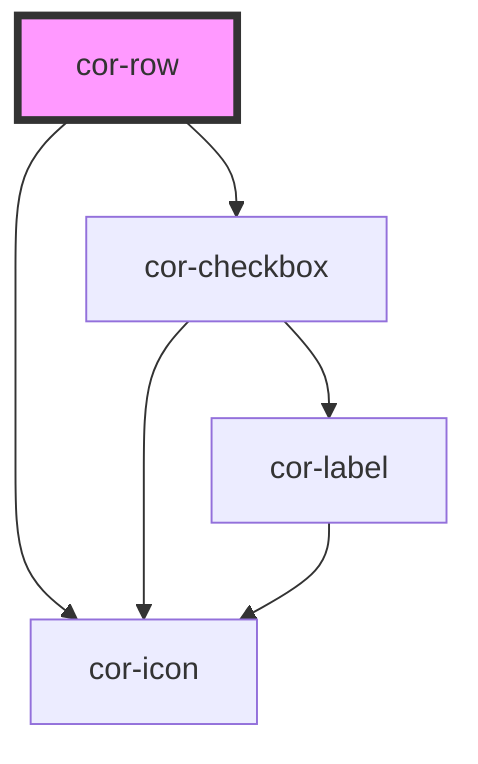

# cor-row

<!-- Auto Generated Below -->

## Overview

Table row — wraps cor-cell elements with hover/active/selected visual states.
Selection state is driven by the consumer via the `selected` prop.

## Properties

| Property     | Attribute    | Description                                                             | Type                  | Default     |
| ------------ | ------------ | ----------------------------------------------------------------------- | --------------------- | ----------- |
| `disabled`   | `disabled`   | Disabled state                                                          | `boolean`             | `false`     |
| `expandable` | `expandable` | Whether the row is expandable                                           | `boolean`             | `false`     |
| `expanded`   | `expanded`   | Expansion state (driven by consumer, but mutable for internal toggling) | `boolean`             | `false`     |
| `rowId`      | `row-id`     | Consumer-controlled identifier for this row                             | `string`              | `''`        |
| `rowIndex`   | `row-index`  | 1-based row index for virtual scrolling/pagination                      | `number \| undefined` | `undefined` |
| `selectable` | `selectable` | Whether to show a selection checkbox in this row                        | `boolean`             | `false`     |
| `selected`   | `selected`   | Visual selected state (driven by consumer, not managed internally)      | `boolean`             | `false`     |

## Events

| Event          | Description                                           | Type                                                 |
| -------------- | ----------------------------------------------------- | ---------------------------------------------------- |
| `corRowClick`  | Emitted when the row is clicked                       | `CustomEvent<{ rowId: string; }>`                    |
| `corRowExpand` | Emitted when expansion is requested                   | `CustomEvent<{ rowId: string; expanded: boolean; }>` |
| `corRowSelect` | Emitted when selection is requested (checkbox toggle) | `CustomEvent<{ rowId: string; selected: boolean; }>` |

## Slots

| Slot       | Description                            |
| ---------- | -------------------------------------- |
|            | Default slot for cor-cell elements     |
| `"expand"` | Content shown when the row is expanded |

## Dependencies

### Depends on

- [cor-checkbox](../cor-checkbox)
- [cor-icon](../cor-icon)

### Graph

----------------------------------------------

*Built with [StencilJS](https://stenciljs.com/)*
