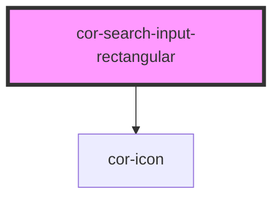

# cor-search-input-rectangular

<!-- Auto Generated Below -->

## Overview

Search Input (rectangular) — single-line search-entry control.

Pattern B (atom-interactive, form-associated): renders its own
`<input type="search">` inside shadow DOM. Adds a leading magnifying-glass
icon and an optional trailing clear `×` button that appears whenever the
control carries a value. Visual primitives (border, focus ring, label,
helper / error, sizes, states) are shared with `cor-input`; specific
affordances (icon-start, icon-end-clear) live in the
`--search-input-rectangular-*` token namespace.

Rectangular shape is the default sibling of `cor-search-input-circular`
(pill). The two ship as distinct components per the Figma component-set
separation in the Republic of Moldova Unified Design System library.

## Properties

| Property       | Attribute      | Description                                                                                                                                                  | Type                         | Default     |
| -------------- | -------------- | ------------------------------------------------------------------------------------------------------------------------------------------------------------ | ---------------------------- | ----------- |
| `ariaLabel`    | `aria-label`   | Accessible name. Mirrors to the internal control's `aria-label` when no visible label is present.                                                            | `string \| undefined`        | `undefined` |
| `autocomplete` | `autocomplete` | Native `autocomplete` attribute forwarded to the internal control.                                                                                           | `string \| undefined`        | `undefined` |
| `clearLabel`   | `clear-label`  | Accessible label for the trailing clear button. Defaults to Romanian "Șterge" per the institutional voice.                                                   | `string`                     | `'Șterge'`  |
| `clearable`    | `clearable`    | Shows the trailing clear `×` button when a value is present. Set to `false` to suppress the affordance entirely (useful for read-only or always-on filters). | `boolean`                    | `true`      |
| `disabled`     | `disabled`     | Disables interactivity. The internal control receives `aria-disabled` and the native `disabled` attribute.                                                   | `boolean`                    | `false`     |
| `errorText`    | `error-text`   | Plain-text error message shown below the control when `invalid` is set. When present it replaces `helperText` and pairs with the error icon.                 | `string \| undefined`        | `undefined` |
| `helperText`   | `helper-text`  | Plain-text helper / hint shown below the control.                                                                                                            | `string \| undefined`        | `undefined` |
| `iconName`     | `icon-name`    | Icon name for the leading icon (rendered via the local SVG library). Override by providing an element to the `icon-start` slot.                              | `string`                     | `'search'`  |
| `invalid`      | `invalid`      | Forces destructive visuals regardless of `variant`. Sets `aria-invalid`. Use together with `errorText` to surface the message.                               | `boolean`                    | `false`     |
| `label`        | `label`        | Plain-text label. Use the `label` slot for richer content.                                                                                                   | `string \| undefined`        | `undefined` |
| `maxLength`    | `maxlength`    | Native `maxlength` constraint.                                                                                                                               | `number \| undefined`        | `undefined` |
| `minLength`    | `minlength`    | Native `minlength` constraint.                                                                                                                               | `number \| undefined`        | `undefined` |
| `name`         | `name`         | Form-control `name`. Used during form submission.                                                                                                            | `string \| undefined`        | `undefined` |
| `placeholder`  | `placeholder`  | Placeholder shown when the control is empty.                                                                                                                 | `string \| undefined`        | `undefined` |
| `readonly`     | `readonly`     | Renders the field read-only. The control remains focusable; the clear affordance is suppressed.                                                              | `boolean`                    | `false`     |
| `required`     | `required`     | Marks the field as mandatory. Adds a red asterisk to the label and sets `aria-required` on the internal control.                                             | `boolean`                    | `false`     |
| `size`         | `size`         | Visual size rung.                                                                                                                                            | `"lg" \| "md"`               | `'md'`      |
| `value`        | `value`        | Current value of the control. Reflects to the host attribute.                                                                                                | `string`                     | `''`        |
| `variant`      | `variant`      | Color treatment. `destructive` is forced when `invalid` is set.                                                                                              | `"default" \| "destructive"` | `'default'` |

## Events

| Event       | Description                                                                                     | Type                                              |
| ----------- | ----------------------------------------------------------------------------------------------- | ------------------------------------------------- |
| `corBlur`   | Fires when the internal control loses focus.                                                    | `CustomEvent<FocusEvent>`                         |
| `corChange` | Fires when the value is committed (typically on `blur`). `detail.value` is the committed value. | `CustomEvent<SearchInputRectangularChangeDetail>` |
| `corClear`  | Fires when the value is cleared by the user (clear button or Escape key).                       | `CustomEvent<void>`                               |
| `corFocus`  | Fires when the internal control gains focus.                                                    | `CustomEvent<FocusEvent>`                         |
| `corInput`  | Fires on every keystroke. `detail.value` is the current control value.                          | `CustomEvent<SearchInputRectangularChangeDetail>` |
| `corSearch` | Fires when the user submits the query (Enter key). `detail.value` is the submitted query.       | `CustomEvent<SearchInputRectangularSearchDetail>` |

## Slots

| Slot           | Description                                                                                             |
| -------------- | ------------------------------------------------------------------------------------------------------- |
| `"helper"`     | Rich helper / hint content, replaces the `helper-text` prop. Hidden when invalid + error-text is shown. |
| `"icon-end"`   | Trailing slot. Suppresses the built-in clear `×` button when content is assigned here.                  |
| `"icon-start"` | Leading icon override. Defaults to `cor-icon[name="search"]`.                                           |
| `"label"`      | Rich label content, replaces the `label` prop when present.                                             |

## Shadow Parts

| Part              | Description |
| ----------------- | ----------- |
| `"clear-button"`  |             |
| `"control"`       |             |
| `"error"`         |             |
| `"helper"`        |             |
| `"label"`         |             |
| `"native"`        |             |
| `"required-mark"` |             |

## Dependencies

### Depends on

- [cor-icon](../cor-icon)

### Graph

----------------------------------------------

*Built with [StencilJS](https://stenciljs.com/)*
