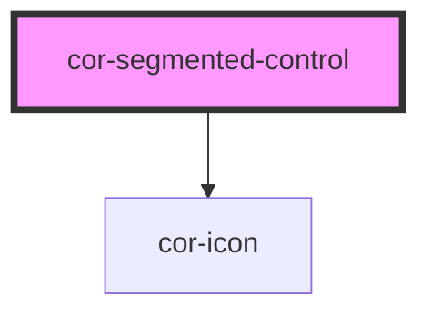

# cor-segmented-control

<!-- Auto Generated Below -->

## Overview

Segmented control — single-select horizontal switcher.

Pattern B (atom-interactive, form-associated): renders an internal
`role="radiogroup"` of `role="radio"` buttons inside the shadow DOM with
a roving `tabindex`. Selected segment gets the dark inverse fill from
Figma 659:8188; unselected segments inherit the light tertiary container
background and only carry their label.

Keyboard contract (WAI-ARIA Authoring Practices, radiogroup pattern):
- `Tab` enters and exits the group (single stop)
- `ArrowLeft` / `ArrowRight` move selection between segments
- `Home` / `End` jump to first / last segment
- `Enter` / `Space` reaffirm selection on the focused segment

## Properties

| Property         | Attribute         | Description                                                                                                                         | Type                                     | Default     |
| ---------------- | ----------------- | ----------------------------------------------------------------------------------------------------------------------------------- | ---------------------------------------- | ----------- |
| `ariaLabel`      | `aria-label`      | Accessible name for the group. Forwarded to the host's `aria-label`. Required when no surrounding `<label>` references the control. | `string \| undefined`                    | `undefined` |
| `ariaLabelledby` | `aria-labelledby` | ID of an element labelling the group (when an external label is used).                                                              | `string \| undefined`                    | `undefined` |
| `disabled`       | `disabled`        | Disables every segment. The container receives `aria-disabled`.                                                                     | `boolean`                                | `false`     |
| `name`           | `name`            | Form-control `name`. Used during form submission.                                                                                   | `string \| undefined`                    | `undefined` |
| `segments`       | --                | Segment configuration. Order in the array maps left-to-right. When omitted the control renders nothing.                             | `SegmentedControlSegment[] \| undefined` | `undefined` |
| `size`           | `size`            | Visual size rung. `md` is 40 px tall; `sm` is 32 px tall.                                                                           | `"md" \| "sm"`                           | `'md'`      |
| `value`          | `value`           | Value of the currently selected segment. Mutable so two-way binding via `@Watch('value')` keeps the host attribute in sync.         | `string \| undefined`                    | `undefined` |

## Events

| Event       | Description                                                                   | Type                                        |
| ----------- | ----------------------------------------------------------------------------- | ------------------------------------------- |
| `corChange` | Fires when the selected segment changes. `detail.value` is the new selection. | `CustomEvent<SegmentedControlChangeDetail>` |

## Slots

| Slot | Description                                                                                                                                                           |
| ---- | --------------------------------------------------------------------------------------------------------------------------------------------------------------------- |
|      | Reserved for future declarative segments. Today, all segments come from the `segments` prop. The slot is rendered hidden so AT does not see accidental content twice. |

## Shadow Parts

| Part      | Description |
| --------- | ----------- |
| `"track"` |             |

## Dependencies

### Depends on

- [cor-icon](../cor-icon)

### Graph

----------------------------------------------

*Built with [StencilJS](https://stenciljs.com/)*
