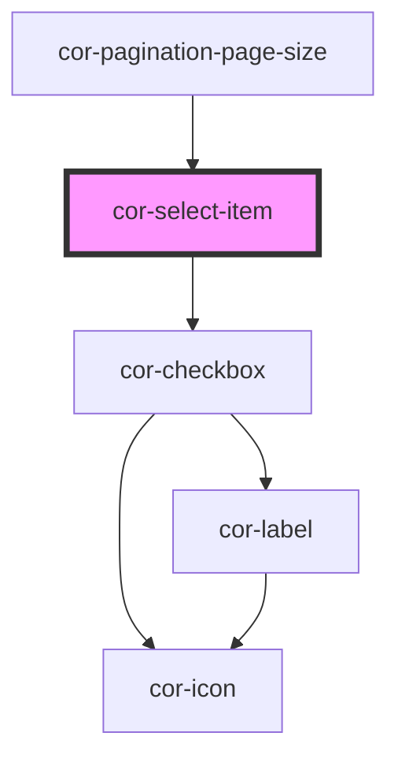

# cor-select-item

<!-- Auto Generated Below -->

## Overview

Select item component - a selectable list item with optional icons, checkbox, avatar, and description.

## Properties

| Property        | Attribute       | Description                                                                                   | Type                                                                                                                               | Default                   |
| --------------- | --------------- | --------------------------------------------------------------------------------------------- | ---------------------------------------------------------------------------------------------------------------------------------- | ------------------------- |
| `description`   | `description`   | Description text (secondary text for basic variant) or timestamp text (for timestamp variant) | `string \| undefined`                                                                                                              | `undefined`               |
| `disabled`      | `disabled`      | Indicates if the item is disabled                                                             | `boolean`                                                                                                                          | `false`                   |
| `indeterminate` | `indeterminate` | Indicates if the checkbox is in indeterminate/mixed state                                     | `boolean`                                                                                                                          | `false`                   |
| `label`         | `label`         | Label text (primary text)                                                                     | `string \| undefined`                                                                                                              | `undefined`               |
| `selected`      | `selected`      | Indicates if the item is selected                                                             | `boolean`                                                                                                                          | `false`                   |
| `value`         | `value`         | Value identifier for this item (used by cor-sorting to identify selection).                   | `string \| undefined`                                                                                                              | `undefined`               |
| `variant`       | `variant`       | Variant of the select item                                                                    | `"basic" \| "label-only" \| "timestamp" \| SelectItemVariant.BASIC \| SelectItemVariant.LABEL_ONLY \| SelectItemVariant.TIMESTAMP` | `SelectItemVariant.BASIC` |

## Events

| Event                | Description                             | Type                   |
| -------------------- | --------------------------------------- | ---------------------- |
| `corSelectionChange` | Emitted when the selected state changes | `CustomEvent<boolean>` |

## Slots

| Slot             | Description                                                                             |
| ---------------- | --------------------------------------------------------------------------------------- |
| `"icon-left"`    | Left icon slot (accepts cor-icon only)                                                  |
| `"icon-right"`   | Right icon slot (accepts cor-icon only)                                                 |
| `"post-content"` | Post-content slot (accepts any component, e.g., cor-badge-interactive, custom elements) |
| `"pre-content"`  | Pre-content slot (accepts any component, e.g., cor-avatar, cor-icon, custom elements)   |

## Dependencies

### Used by

 - [cor-pagination-page-size](../cor-pagination-page-size)

### Depends on

- [cor-checkbox](../cor-checkbox)

### Graph

----------------------------------------------

*Built with [StencilJS](https://stenciljs.com/)*
