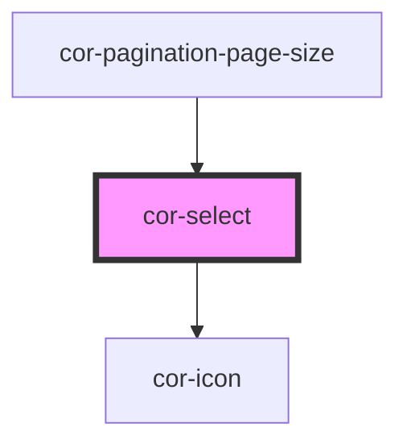

# cor-select

<!-- Auto Generated Below -->

## Overview

Select component with custom dropdown styling.

## Properties

| Property       | Attribute       | Description                                           | Type                                                                                                            | Default                   |
| -------------- | --------------- | ----------------------------------------------------- | --------------------------------------------------------------------------------------------------------------- | ------------------------- |
| `disabled`     | `disabled`      | Indicates if select is disabled                       | `boolean`                                                                                                       | `false`                   |
| `inline`       | `inline`        | Inline mode - width adjusts to fit options content    | `boolean`                                                                                                       | `false`                   |
| `invalid`      | `invalid`       | Indicates if select is invalid                        | `boolean`                                                                                                       | `false`                   |
| `listPosition` | `list-position` | Position of the dropdown list relative to the trigger | `"auto" \| "bottom" \| "top" \| SelectListPosition.AUTO \| SelectListPosition.BOTTOM \| SelectListPosition.TOP` | `SelectListPosition.AUTO` |
| `name`         | `name`          | Select name attribute                                 | `string \| undefined`                                                                                           | `undefined`               |
| `placeholder`  | `placeholder`   | Placeholder text shown when no value is selected      | `string \| undefined`                                                                                           | `undefined`               |
| `required`     | `required`      | Indicates if select is required                       | `boolean`                                                                                                       | `false`                   |
| `selectId`     | `select-id`     | Select id attribute                                   | `string \| undefined`                                                                                           | `undefined`               |
| `size`         | `size`          | Size of the select                                    | `SelectSize.LG \| SelectSize.MD \| SelectSize.SM`                                                               | `SelectSize.LG`           |
| `value`        | `value`         | Select value                                          | `string \| undefined`                                                                                           | `''`                      |

## Events

| Event       | Description                       | Type                              |
| ----------- | --------------------------------- | --------------------------------- |
| `corBlur`   | Emitted when select loses focus   | `CustomEvent<void>`               |
| `corChange` | Emitted when select value changes | `CustomEvent<{ value: string; }>` |
| `corFocus`  | Emitted when select gains focus   | `CustomEvent<void>`               |

## Slots

| Slot | Description                                        |
| ---- | -------------------------------------------------- |
|      | cor-select-item elements with variant="label-only" |

## Dependencies

### Used by

 - [cor-pagination-page-size](../cor-pagination-page-size)

### Depends on

- [cor-icon](../cor-icon)

### Graph

----------------------------------------------

*Built with [StencilJS](https://stenciljs.com/)*
