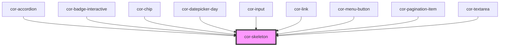

# cor-skeleton

<!-- Auto Generated Below -->

## Properties

| Property          | Attribute          | Description                             | Type                  | Default     |
| ----------------- | ------------------ | --------------------------------------- | --------------------- | ----------- |
| `backgroundColor` | `background-color` | Background color of the skeleton loader | `string \| undefined` | `undefined` |
| `borderRadius`    | `border-radius`    | Border radius of the skeleton loader    | `string \| undefined` | `undefined` |
| `height`          | `height`           | Height of the skeleton loader           | `string \| undefined` | `undefined` |
| `width`           | `width`            | Width of the skeleton loader            | `string \| undefined` | `undefined` |

## Slots

| Slot | Description                                |
| ---- | ------------------------------------------ |
|      | Default slot for nested content (optional) |

## Dependencies

### Used by

 - [cor-accordion](../cor-accordion)
 - [cor-badge-interactive](../cor-badge-interactive)
 - [cor-chip](../cor-chip)
 - [cor-datepicker-day](../cor-datepicker-day)
 - [cor-input](../cor-input)
 - [cor-link](../cor-link)
 - [cor-menu-button](../cor-menu-button)
 - [cor-pagination-item](../cor-pagination-item)
 - [cor-textarea](../cor-textarea)

### Graph

----------------------------------------------

*Built with [StencilJS](https://stenciljs.com/)*
