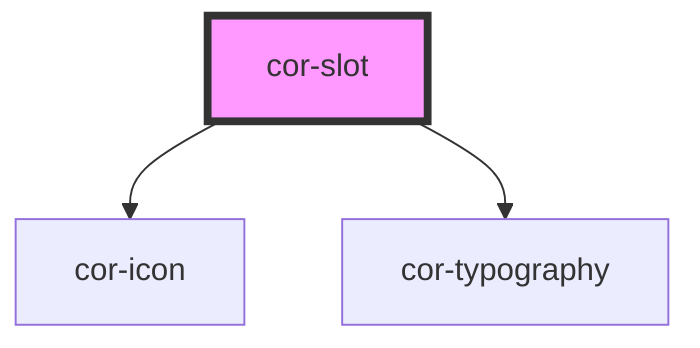

# cor-slot

<!-- Auto Generated Below -->

## Overview

Slot container used to display contextual information.

## Properties

| Property | Attribute | Description                 | Type                                         | Default       |
| -------- | --------- | --------------------------- | -------------------------------------------- | ------------- |
| `size`   | `size`    | Size of the slot container. | `"lg" \| "sm" \| SlotSize.LG \| SlotSize.SM` | `SlotSize.LG` |

## Slots

| Slot            | Description                             |
| --------------- | --------------------------------------- |
| `"default"`     | Slot body content.                      |
| `"description"` | Optional description (lg only).         |
| `"icon"`        | Icon displayed in the title area.       |
| `"title"`       | Title content (usually cor-typography). |

## Dependencies

### Depends on

- [cor-icon](../cor-icon)
- [cor-typography](../cor-typography)

### Graph

----------------------------------------------

*Built with [StencilJS](https://stenciljs.com/)*
