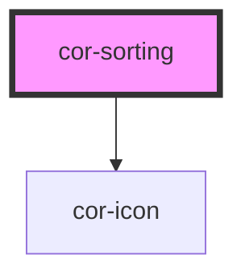

# cor-sorting

<!-- Auto Generated Below -->

## Overview

A controlled sorting/dropdown selector that displays a label + current value with a chevron.
Clicking opens an options list. Consumer slots `<cor-select-item variant="label-only">` children.
Supports keyboard navigation and controlled usage.

## Properties

| Property   | Attribute  | Description                                                                                                                                                 | Type                               | Default          |
| ---------- | ---------- | ----------------------------------------------------------------------------------------------------------------------------------------------------------- | ---------------------------------- | ---------------- |
| `disabled` | `disabled` | Disables the component.                                                                                                                                     | `boolean`                          | `false`          |
| `label`    | `label`    | Label text shown before the selected value.                                                                                                                 | `string`                           | `''`             |
| `size`     | `size`     | Size variant.                                                                                                                                               | `SortingSize.MD \| SortingSize.SM` | `SortingSize.MD` |
| `value`    | `value`    | Currently selected value (controlled). Matches the `value` prop of a slotted `cor-select-item`. If unset, the label of the first slotted item is displayed. | `string \| undefined`              | `undefined`      |

## Events

| Event              | Description                                                                                        | Type                  |
| ------------------ | -------------------------------------------------------------------------------------------------- | --------------------- |
| `corSortingChange` | Emitted when the user selects an option. Payload is the `value` of the selected `cor-select-item`. | `CustomEvent<string>` |

## Slots

| Slot | Description                                        |
| ---- | -------------------------------------------------- |
|      | Default slot for `cor-select-item` option elements |

## Dependencies

### Depends on

- [cor-icon](../cor-icon)

### Graph

----------------------------------------------

*Built with [StencilJS](https://stenciljs.com/)*
