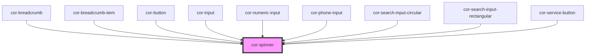

# cor-spinner

<!-- Auto Generated Below -->

## Overview

Spinner — animated circular loading indicator.

Pattern B (atom-visual): renders a CSS-only rotating arc.
No slots, no events, no interactivity.

## Properties

| Property  | Attribute | Description                          | Type                                               | Default     |
| --------- | --------- | ------------------------------------ | -------------------------------------------------- | ----------- |
| `label`   | `label`   | Accessible label for screen readers. | `string`                                           | `'Loading'` |
| `size`    | `size`    | Visual size rung.                    | `"lg" \| "md" \| "sm" \| "xs"`                     | `'md'`      |
| `variant` | `variant` | Color treatment.                     | `"brand" \| "dark" \| "light" \| "light-on-color"` | `'brand'`   |

## Dependencies

### Used by

 - [cor-breadcrumb](../cor-breadcrumb)
 - [cor-breadcrumb-item](../cor-breadcrumb)
 - [cor-button](../cor-button)
 - [cor-input](../cor-input)
 - [cor-numeric-input](../cor-numeric-input)
 - [cor-phone-input](../cor-phone-input)
 - [cor-search-input-circular](../cor-search-input-circular)
 - [cor-search-input-rectangular](../cor-search-input-rectangular)
 - [cor-service-button](../cor-service-button)

### Graph

----------------------------------------------

*Built with [StencilJS](https://stenciljs.com/)*
