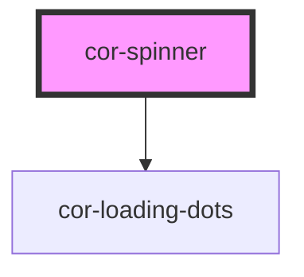

# cor-spinner

<!-- Auto Generated Below -->

## Overview

Spinner component — animated circular loading indicator with three-dot center.

## Properties

| Property   | Attribute   | Description                          | Type                                                                                       | Default           |
| ---------- | ----------- | ------------------------------------ | ------------------------------------------------------------------------------------------ | ----------------- |
| `hideDots` | `hide-dots` | Hide the center loading dots.        | `boolean`                                                                                  | `false`           |
| `label`    | `label`     | Accessible label for screen readers. | `string`                                                                                   | `'Loading'`       |
| `size`     | `size`      | Size of the spinner.                 | `SpinnerSize.LG \| SpinnerSize.MD \| SpinnerSize.SM \| SpinnerSize.XLG \| SpinnerSize.XSM` | `SpinnerSize.XLG` |

## Dependencies

### Depends on

- [cor-loading-dots](../cor-loading-dots)

### Graph

----------------------------------------------

*Built with [StencilJS](https://stenciljs.com/)*
