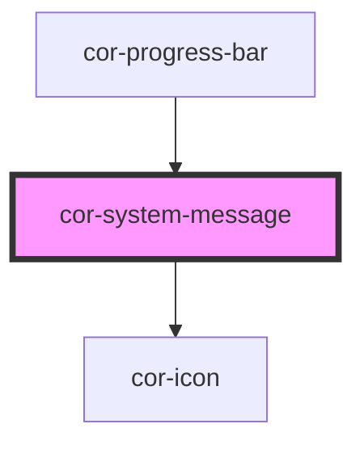

# cor-system-message

<!-- Auto Generated Below -->

## Overview

Lightweight inline system message. Used within forms and content areas to
convey validation state (alert), guidance (info), or plain text annotation.

Reuses the icon+slot pattern from cor-input's helper-text area.
No dismiss, no elevation, no accent bar, no title slot.

## Properties

| Property | Attribute | Description                                                                                                                                                                               | Type                                                                             | Default                   |
| -------- | --------- | ----------------------------------------------------------------------------------------------------------------------------------------------------------------------------------------- | -------------------------------------------------------------------------------- | ------------------------- |
| `state`  | `state`   | State of the message. Controls icon and text colour. - `alert`  — Error/danger with warning icon. - `info`   — Informational with info icon. - `text`   — Plain text annotation, no icon. | `SystemMessageState.ALERT \| SystemMessageState.INFO \| SystemMessageState.TEXT` | `SystemMessageState.TEXT` |

## Slots

| Slot | Description                            |
| ---- | -------------------------------------- |
|      | Default slot for message text content. |

## Dependencies

### Used by

 - [cor-progress-bar](../cor-progress-bar)

### Depends on

- [cor-icon](../cor-icon)

### Graph

----------------------------------------------

*Built with [StencilJS](https://stenciljs.com/)*
