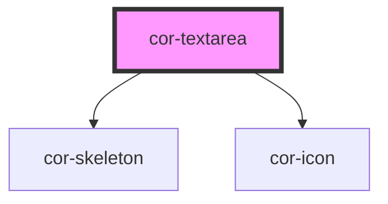

# cor-textarea

<!-- Auto Generated Below -->

## Overview

Textarea component with label positioning, state management, and resize control.

## Properties

| Property        | Attribute        | Description                                                                                                                                                         | Type                                                                                                 | Default                        |
| --------------- | ---------------- | ------------------------------------------------------------------------------------------------------------------------------------------------------------------- | ---------------------------------------------------------------------------------------------------- | ------------------------------ |
| `cols`          | `cols`           | Number of visible text columns                                                                                                                                      | `number \| undefined`                                                                                | `undefined`                    |
| `disabled`      | `disabled`       | Indicates if textarea is disabled                                                                                                                                   | `boolean`                                                                                            | `false`                        |
| `invalid`       | `invalid`        | Indicates if textarea is invalid                                                                                                                                    | `boolean`                                                                                            | `false`                        |
| `label`         | `label`          | Label text                                                                                                                                                          | `string \| undefined`                                                                                | `undefined`                    |
| `labelInfo`     | `label-info`     | Info text to show in tooltip when hovering info icon next to label (only for labelPosition="outside") When provided, displays info icon with native browser tooltip | `string \| undefined`                                                                                | `undefined`                    |
| `labelPosition` | `label-position` | Label position (inside or outside)                                                                                                                                  | `TextareaLabelPosition.INSIDE \| TextareaLabelPosition.OUTSIDE`                                      | `TextareaLabelPosition.INSIDE` |
| `maxlength`     | `maxlength`      | Maximum length of textarea value                                                                                                                                    | `number \| undefined`                                                                                | `undefined`                    |
| `minlength`     | `minlength`      | Minimum length of textarea value                                                                                                                                    | `number \| undefined`                                                                                | `undefined`                    |
| `name`          | `name`           | Textarea name attribute                                                                                                                                             | `string \| undefined`                                                                                | `undefined`                    |
| `placeholder`   | `placeholder`    | Textarea placeholder text                                                                                                                                           | `string \| undefined`                                                                                | `undefined`                    |
| `required`      | `required`       | Indicates if textarea is required                                                                                                                                   | `boolean`                                                                                            | `false`                        |
| `resize`        | `resize`         | Resize behavior of the textarea                                                                                                                                     | `TextareaResize.BOTH \| TextareaResize.HORIZONTAL \| TextareaResize.NONE \| TextareaResize.VERTICAL` | `TextareaResize.VERTICAL`      |
| `rows`          | `rows`           | Number of visible text rows                                                                                                                                         | `number \| undefined`                                                                                | `4`                            |
| `skeleton`      | `skeleton`       | Show skeleton loading state                                                                                                                                         | `boolean`                                                                                            | `false`                        |
| `textareaId`    | `textarea-id`    | Textarea id attribute                                                                                                                                               | `string \| undefined`                                                                                | `undefined`                    |
| `value`         | `value`          | Textarea value                                                                                                                                                      | `string \| undefined`                                                                                | `''`                           |

## Events

| Event      | Description                         | Type                  |
| ---------- | ----------------------------------- | --------------------- |
| `corBlur`  | Emitted when textarea loses focus   | `CustomEvent<void>`   |
| `corFocus` | Emitted when textarea gains focus   | `CustomEvent<void>`   |
| `corInput` | Emitted when textarea value changes | `CustomEvent<string>` |

## Slots

| Slot            | Description                                                      |
| --------------- | ---------------------------------------------------------------- |
| `"helper-text"` | Helper text content slot (icon and styling handled by component) |

## Dependencies

### Depends on

- [cor-skeleton](../cor-skeleton)
- [cor-icon](../cor-icon)

### Graph

----------------------------------------------

*Built with [StencilJS](https://stenciljs.com/)*
