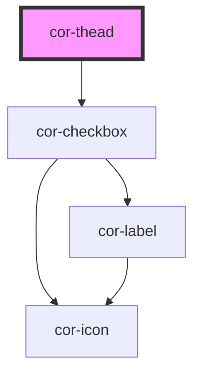

# cor-thead

<!-- Auto Generated Below -->

## Overview

Table header manager — renders the header row containing cor-column elements.
Supports optional select-all checkbox (Phase 3).

## Properties

| Property                 | Attribute                  | Description                                                         | Type      | Default |
| ------------------------ | -------------------------- | ------------------------------------------------------------------- | --------- | ------- |
| `expandable`             | `expandable`               | Enable row expand/collapse in header                                | `boolean` | `false` |
| `selectAllChecked`       | `select-all-checked`       | State of the select-all checkbox (driven by consumer)               | `boolean` | `false` |
| `selectAllIndeterminate` | `select-all-indeterminate` | Indeterminate state of the select-all checkbox (driven by consumer) | `boolean` | `false` |
| `selectable`             | `selectable`               | Enable row selection checkbox in header                             | `boolean` | `false` |

## Events

| Event          | Description                                 | Type                                  |
| -------------- | ------------------------------------------- | ------------------------------------- |
| `corSelectAll` | Emitted when select-all checkbox is toggled | `CustomEvent<{ selected: boolean; }>` |

## Slots

| Slot | Description                          |
| ---- | ------------------------------------ |
|      | Default slot for cor-column elements |

## Dependencies

### Depends on

- [cor-checkbox](../cor-checkbox)

### Graph

----------------------------------------------

*Built with [StencilJS](https://stenciljs.com/)*
