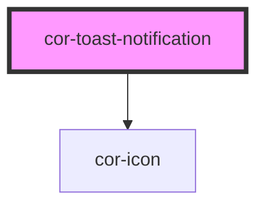

# cor-toast-notification

<!-- Auto Generated Below -->

## Overview

Floating toast notification. Appends itself to `<body>` on mount so it
renders above all other content. Supports auto-dismiss with hover-pause,
and an entrance/exit animation.

Supported states: error · warning · success · info · neutral

## Properties

| Property      | Attribute     | Description                                                                                                                 | Type                                                                                                                                                                      | Default                     |
| ------------- | ------------- | --------------------------------------------------------------------------------------------------------------------------- | ------------------------------------------------------------------------------------------------------------------------------------------------------------------------- | --------------------------- |
| `autoClose`   | `auto-close`  | Milliseconds before the toast auto-dismisses. Set to `0` to disable. The timer pauses while the user hovers over the toast. | `number`                                                                                                                                                                  | `5000`                      |
| `dismissible` | `dismissible` | When `true`, renders a dismiss button.                                                                                      | `boolean`                                                                                                                                                                 | `true`                      |
| `position`    | `position`    | Screen position of the toast.                                                                                               | `ToastPosition.BOTTOM_CENTER \| ToastPosition.BOTTOM_LEFT \| ToastPosition.BOTTOM_RIGHT \| ToastPosition.TOP_CENTER \| ToastPosition.TOP_LEFT \| ToastPosition.TOP_RIGHT` | `ToastPosition.BOTTOM_LEFT` |
| `state`       | `state`       | Semantic state of the toast. Controls icon, accent colour, background, and title colour.                                    | `NotificationState.ERROR \| NotificationState.INFO \| NotificationState.NEUTRAL \| NotificationState.SUCCESS \| NotificationState.WARNING`                                | `NotificationState.INFO`    |

## Events

| Event        | Description                                                                    | Type                |
| ------------ | ------------------------------------------------------------------------------ | ------------------- |
| `corDismiss` | Emitted when the toast is dismissed (by button, timeout, or programmatically). | `CustomEvent<void>` |

## Slots

| Slot           | Description                                              |
| -------------- | -------------------------------------------------------- |
| `"action"`     | CTA button. Maximum 2 `cor-button` elements recommended. |
| `"close-icon"` | Override the dismiss icon.                               |
| `"icon"`       | Override the semantic icon. Accepts `cor-icon` only.     |
| `"meta"`       | Metadata (e.g. timestamp).                               |
| `"subtitle"`   | Supporting description.                                  |
| `"title"`      | Heading text.                                            |

## Dependencies

### Depends on

- [cor-icon](../cor-icon)

### Graph

----------------------------------------------

*Built with [StencilJS](https://stenciljs.com/)*
