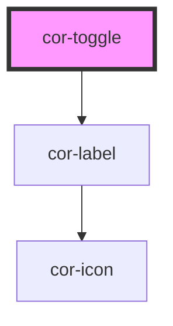

# cor-toggle

<!-- Auto Generated Below -->

## Overview

Toggle/Switch component with form association.

## Properties

| Property   | Attribute  | Description                         | Type                             | Default         |
| ---------- | ---------- | ----------------------------------- | -------------------------------- | --------------- |
| `checked`  | `checked`  | Checked state                       | `boolean`                        | `false`         |
| `disabled` | `disabled` | Indicates if toggle is disabled     | `boolean`                        | `false`         |
| `invalid`  | `invalid`  | Indicates if toggle is invalid      | `boolean`                        | `false`         |
| `name`     | `name`     | Name attribute for form submission  | `string \| undefined`            | `undefined`     |
| `size`     | `size`     | Size of the toggle                  | `ToggleSize.MD \| ToggleSize.SM` | `ToggleSize.MD` |
| `value`    | `value`    | Value attribute for form submission | `string \| undefined`            | `'on'`          |

## Events

| Event       | Description                        | Type                   |
| ----------- | ---------------------------------- | ---------------------- |
| `corChange` | Emitted when checked state changes | `CustomEvent<boolean>` |

## Slots

| Slot           | Description                                                   |
| -------------- | ------------------------------------------------------------- |
|                | Label content for the right side of the toggle (default slot) |
| `"label-left"` | Label content for the left side of the toggle                 |

## Dependencies

### Depends on

- [cor-label](../cor-label)

### Graph

----------------------------------------------

*Built with [StencilJS](https://stenciljs.com/)*
