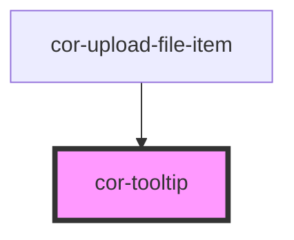

# cor-tooltip

<!-- Auto Generated Below -->

## Overview

A tooltip component that displays contextual information on hover, click, or focus.

## Properties

| Property       | Attribute       | Description                                                       | Type                                                                                                                                                                                                                                                                                                                                                                                                                                                                                                                                   | Default                |
| -------------- | --------------- | ----------------------------------------------------------------- | -------------------------------------------------------------------------------------------------------------------------------------------------------------------------------------------------------------------------------------------------------------------------------------------------------------------------------------------------------------------------------------------------------------------------------------------------------------------------------------------------------------------------------------- | ---------------------- |
| `disabled`     | `disabled`      | Prevent tooltip from showing.                                     | `boolean`                                                                                                                                                                                                                                                                                                                                                                                                                                                                                                                              | `false`                |
| `flipFallback` | `flip-fallback` | Auto-flip to opposite side if not enough space on preferred side. | `boolean`                                                                                                                                                                                                                                                                                                                                                                                                                                                                                                                              | `true`                 |
| `hideDelay`    | `hide-delay`    | Delay in ms before hiding the tooltip.                            | `number`                                                                                                                                                                                                                                                                                                                                                                                                                                                                                                                               | `150`                  |
| `interactive`  | `interactive`   | Keep tooltip open when hovering over tooltip content.             | `boolean`                                                                                                                                                                                                                                                                                                                                                                                                                                                                                                                              | `false`                |
| `maxWidth`     | `max-width`     | Maximum width of the tooltip container.                           | `string`                                                                                                                                                                                                                                                                                                                                                                                                                                                                                                                               | `'280px'`              |
| `offset`       | `offset`        | Distance in px between trigger and tooltip.                       | `number`                                                                                                                                                                                                                                                                                                                                                                                                                                                                                                                               | `4`                    |
| `open`         | `open`          | Controlled open state (used with trigger="manual").               | `boolean`                                                                                                                                                                                                                                                                                                                                                                                                                                                                                                                              | `false`                |
| `placement`    | `placement`     | Preferred placement of the tooltip relative to the trigger.       | `"bottom" \| "bottom-left" \| "bottom-right" \| "left" \| "left-bottom" \| "left-top" \| "right" \| "right-bottom" \| "right-top" \| "top" \| "top-left" \| "top-right" \| TooltipPlacement.BOTTOM \| TooltipPlacement.BOTTOM_LEFT \| TooltipPlacement.BOTTOM_RIGHT \| TooltipPlacement.LEFT \| TooltipPlacement.LEFT_BOTTOM \| TooltipPlacement.LEFT_TOP \| TooltipPlacement.RIGHT \| TooltipPlacement.RIGHT_BOTTOM \| TooltipPlacement.RIGHT_TOP \| TooltipPlacement.TOP \| TooltipPlacement.TOP_LEFT \| TooltipPlacement.TOP_RIGHT` | `TooltipPlacement.TOP` |
| `showArrow`    | `show-arrow`    | Show or hide the CSS triangle arrow.                              | `boolean`                                                                                                                                                                                                                                                                                                                                                                                                                                                                                                                              | `true`                 |
| `showDelay`    | `show-delay`    | Delay in ms before showing the tooltip.                           | `number`                                                                                                                                                                                                                                                                                                                                                                                                                                                                                                                               | `200`                  |
| `trigger`      | `trigger`       | How the tooltip is triggered.                                     | `"click" \| "focus" \| "hover" \| "manual" \| TooltipTrigger.CLICK \| TooltipTrigger.FOCUS \| TooltipTrigger.HOVER \| TooltipTrigger.MANUAL`                                                                                                                                                                                                                                                                                                                                                                                           | `TooltipTrigger.HOVER` |

## Events

| Event            | Description | Type                |
| ---------------- | ----------- | ------------------- |
| `corTooltipHide` |             | `CustomEvent<void>` |
| `corTooltipShow` |             | `CustomEvent<void>` |

## Slots

| Slot            | Description                                                  |
| --------------- | ------------------------------------------------------------ |
|                 | Default slot for additional tooltip content.                 |
| `"description"` | Tooltip description. Accepts cor-typography, cor-icon, span. |
| `"title"`       | Tooltip title. Accepts cor-typography, cor-icon, span.       |
| `"trigger"`     | The element that triggers the tooltip.                       |

## Dependencies

### Used by

 - [cor-upload-file-item](../cor-upload-file-item)

### Graph

----------------------------------------------

*Built with [StencilJS](https://stenciljs.com/)*
