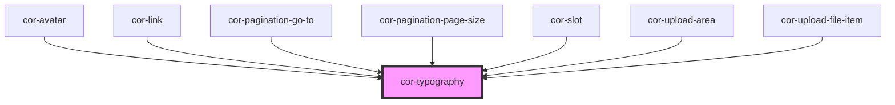

# cor-typography

<!-- Auto Generated Below -->

## Overview

A text wrapping component to easily add styled text markup.

## Properties

| Property  | Attribute | Description                                           | Type                                                                                                                                                                                                                                                                                                                                                                                                                                                                                                                                                                                                                                                                                                                                                                                                                                                                                                                                                                                                    | Default                |
| --------- | --------- | ----------------------------------------------------- | ------------------------------------------------------------------------------------------------------------------------------------------------------------------------------------------------------------------------------------------------------------------------------------------------------------------------------------------------------------------------------------------------------------------------------------------------------------------------------------------------------------------------------------------------------------------------------------------------------------------------------------------------------------------------------------------------------------------------------------------------------------------------------------------------------------------------------------------------------------------------------------------------------------------------------------------------------------------------------------------------------- | ---------------------- |
| `color`   | `color`   |                                                       | `"color-neutral-text-default" \| "color-neutral-text-inverted" \| "color-neutral-text-inverted-static" \| "color-neutral-text-inverted-weak" \| "color-neutral-text-inverted-weaker" \| "color-neutral-text-inverted-weakest" \| "color-neutral-text-static" \| "color-neutral-text-weak" \| "color-neutral-text-weaker" \| "color-neutral-text-weakest" \| "color-primary-text-default" \| "color-primary-text-inverted" \| "color-primary-text-inverted-weak" \| "color-primary-text-inverted-weakest" \| "color-primary-text-weak" \| "color-primary-text-weaker" \| "color-primary-text-weakest" \| "color-secondary-text-default" \| "color-secondary-text-weak" \| "color-secondary-text-weakest" \| "color-system-error-text" \| "color-system-error-text-inverted" \| "color-system-info-text" \| "color-system-info-text-inverted" \| "color-system-success-text" \| "color-system-success-text-inverted" \| "color-system-warning-text" \| "color-system-warning-text-inverted" \| undefined` | `undefined`            |
| `variant` | `variant` | Select the valid HTML tag to render the text element. | `"body-lg" \| "body-lg-semibold" \| "body-lg-underline" \| "body-md" \| "body-md-semibold" \| "body-md-underline" \| "body-sm" \| "body-sm-semibold" \| "body-xs" \| "body-xs-semibold" \| "body-xs-uppercase" \| "heading-2xl" \| "heading-3xl" \| "heading-4xl" \| "heading-lg" \| "heading-md" \| "heading-sm" \| "heading-xl" \| textVariants.BODY_LG \| textVariants.BODY_LG_SEMIBOLD \| textVariants.BODY_LG_UNDERLINE \| textVariants.BODY_MD \| textVariants.BODY_MD_SEMIBOLD \| textVariants.BODY_MD_UNDERLINE \| textVariants.BODY_SM \| textVariants.BODY_SM_SEMIBOLD \| textVariants.BODY_XS \| textVariants.BODY_XS_SEMIBOLD \| textVariants.BODY_XS_UPPERCASE \| textVariants.HEADING_2XL \| textVariants.HEADING_3XL \| textVariants.HEADING_4XL \| textVariants.HEADING_LG \| textVariants.HEADING_MD \| textVariants.HEADING_SM \| textVariants.HEADING_XL`                                                                                                                            | `textVariants.BODY_MD` |

## Slots

| Slot            | Description                  |
| --------------- | ---------------------------- |
| `"defaultSlot"` | the text contents to render. |

## Dependencies

### Used by

 - [cor-avatar](../cor-avatar)
 - [cor-link](../cor-link)
 - [cor-pagination-go-to](../cor-pagination-go-to)
 - [cor-pagination-page-size](../cor-pagination-page-size)
 - [cor-slot](../cor-slot)
 - [cor-upload-area](../cor-upload-area)
 - [cor-upload-file-item](../cor-upload-file-item)

### Graph

----------------------------------------------

*Built with [StencilJS](https://stenciljs.com/)*
